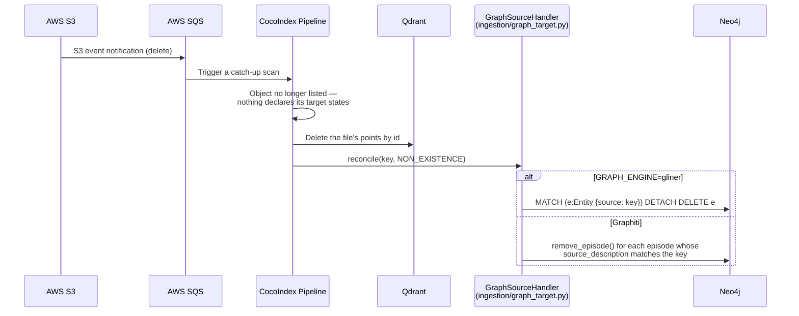

# Data Flow

Four data paths define how data moves through Spektr: **bulk ingest** (S3 to stores), **live ingest** (streaming text to stores), **query** (agent searches), and **delete/invalidation** (removing stale data).

---

## Bulk ingest path (Path A)

A document lands in S3, an SQS event triggers a catch-up scan, and the changed object flows through the CocoIndex pipeline into Qdrant and Neo4j. When `SCHEMA_INDUCTION_ENABLED=true` and `GRAPH_ENGINE=gliner`, a per-document LLM call proposes domain-specific entity types before GLiNER2 extraction.

```mermaid
sequenceDiagram
    participant S3 as AWS S3
    participant SQS as AWS SQS
    participant Coco as CocoIndex Pipeline
    participant FP as File Processor
    participant Jina as Jina v4 API
    participant Sparse as miniCOIL<br/>(local CPU, fastembed)
    participant QD as Qdrant
    participant GE as Graph Engine<br/>(Graphiti or GLiNER2)
    participant LMDB as CocoIndex LMDB state

    S3->>SQS: S3 event notification (create/update)
    SQS->>Coco: Trigger (debounced) — run a catch-up scan
    Coco->>Coco: List objects; skip unchanged (memoized)
    Coco->>FP: Read file bytes + source key

    FP->>FP: Guess MIME type
    alt Text file (md, txt, csv, json, xml, html, yaml)
        FP->>FP: Decode to text pages
    else PDF
        FP->>FP: pdf2image → page images + text extraction
    else Image (png, jpg, webp, ...)
        FP->>FP: Raw image bytes as single page
    end

    FP-->>Coco: List of pages (text and/or image)

    loop Each text page
        Coco->>FP: Semantic chunking
        FP-->>Coco: TextChunk list

        loop Each chunk
            Coco->>Jina: embed_text(chunk)
            Jina-->>Coco: dense vector (512-d)
            Coco->>Sparse: encode_documents(chunk)
            Sparse-->>Coco: sparse vector (miniCOIL)
            Coco->>Coco: declare_point on the documents_dense target<br/>(named vectors: dense + sparse)
        end

        Coco->>GE: engine.ingest(chunks, source_key)
        Note over GE: Graphiti: LLM extraction + episodes<br/>GLiNER2: local model + Cypher MERGE
    end

    loop Each PDF page
        alt Visual content detected (smart gating)
            Coco->>Jina: embed_image(resized page, 400px) → dense
            Jina-->>Coco: dense vector (512-d)
            Coco->>Coco: declare_point on documents_dense

            opt ColBERT enabled
                Coco->>Jina: embed_image_multivec(page) → ColBERT
                Jina-->>Coco: multi-vector (N × 128-d)
                Coco->>Coco: declare_point on documents_multivec
            end
        else Text-only page
            Coco->>QD: Store thumbnail (200px, no embedding)
        end
    end

    loop Each standalone image
        Coco->>Jina: embed_image(image) → dense
        Jina-->>Coco: dense vector (512-d)
        Coco->>Coco: declare_point on documents_dense
    end

    Coco->>QD: Flush declared points (batched, after the file succeeds)
    Coco->>LMDB: Write memoization entry + target-state records
```

### Key design decisions in the bulk ingest path

- **Deterministic IDs** -- chunk and point IDs are derived from `{source_file}::p{page}::c{chunk_idx}` via UUID5, so re-ingesting a file reuses the same point ids instead of duplicating.
- **Declared, not upserted** -- points are declared on CocoIndex's native Qdrant collection targets and flushed by the engine across the reconcile batch. Nothing reaches Qdrant until the file's component has fully succeeded, so a mid-file failure cannot leave a half-written document.
- **Dual embedding for visual content** -- images get both a dense single-vector (for standard NN search) and ColBERT multi-vectors (for layout-aware retrieval). Text chunks get a dense vector plus a miniCOIL sparse vector (local CPU, no API cost) on the same `documents_dense` point, for the lexical retrieval channel used by `multi_search`/`hybrid_search`.
- **Dynamic schema induction** -- when enabled, a single LLM call per document proposes domain-specific entity/relationship types for GLiNER2. Results are cached by content hash. See [Knowledge Graph](../ingestion/knowledge-graph.md).
- **Pluggable graph engine** -- text chunks are passed to `engine.ingest()`. Graphiti submits them as LLM-processed episodes; GLiNER2 extracts entities and relations locally and writes directly to Neo4j. See [Knowledge Graph](../ingestion/knowledge-graph.md).

---

## Live ingest path (Path B)

Streaming text data arrives via HTTP POST to the live ingestion FastAPI server and is indexed into Qdrant immediately. Graphiti temporal graph ingestion runs as a background task.

```mermaid
sequenceDiagram
    participant Src as External Source
    participant API as Live Ingest API<br/>(FastAPI, port 8001)
    participant Jina as Jina v4 API
    participant Sparse as miniCOIL<br/>(local CPU, fastembed)
    participant QD as Qdrant
    participant Graphiti as Graphiti
    participant Neo4j as Neo4j

    Src->>API: POST /session/start {session_id, metadata}
    API-->>Src: {status: "active"}

    loop Each text chunk (~every 30s)
        Src->>API: POST /ingest/chunk {session_id, text, timestamp}
        API->>Jina: embed_text(text)
        Jina-->>API: dense vector (512-d)
        API->>Sparse: encode_documents(text) (offloaded to a thread)
        Sparse-->>API: sparse vector (miniCOIL)
        API->>QD: Upsert to documents_dense<br/>(dense + sparse; is_live=true, session_id, timestamp)
        API-->>Src: {status: "accepted", vector_indexed: true, graph_status: "processing"}

        Note over API,Graphiti: Background task (does not block response)
        API->>Graphiti: add_episode(text, group_id=session_id, reference_time=timestamp)
        Graphiti->>Neo4j: Create/update temporal entities and edges
    end

    Src->>API: POST /session/end {session_id, archive}
    alt archive = true
        API->>QD: Set is_live=false on session points
        Note over Neo4j: Graphiti data kept permanently
    else archive = false
        API->>QD: Delete points by session_id
        API->>Graphiti: Delete episodes by group_id
    end
    API-->>Src: {status: "ended"}
```

### Key design decisions in the live ingest path

- **Immediate vector availability** -- the HTTP response returns after Qdrant upsert (~200ms). Graphiti runs in the background (~2-5s per chunk).
- **Session isolation** -- all live data is tagged with `session_id` and `is_live=true`. Graphiti partitions by `group_id=session_id`.
- **Clean lifecycle** -- sessions can be archived (data becomes permanent KB) or discarded (full purge from both Qdrant and Neo4j).
- **Single active session** -- v1 supports one active session at a time to avoid LLM rate limit contention.

---

## Query path

An LLM agent calls one of the seven MCP tools. The five search tools (`vector_search`, `visual_search`, `graph_search`, `multi_search`, `hybrid_search`) embed the query and search the relevant store. The two listing/inventory tools (`list_documents`, `list_document_chunks`) enumerate what's in the corpus without running a similarity query — useful for agents that need to ground a question against an exhaustive view of the available material before searching. The sequence diagram below covers the search tools; listing tools follow a simpler path (Auth → Tool → Qdrant scroll → results).

`multi_search` and `hybrid_search` share the same fused retrieval core — dense + sparse channels merged with Reciprocal Rank Fusion (RRF), then reranked — and return an identical response schema. `hybrid_search` wraps that core in two extra LLM-touching stages: query decomposition before retrieval, and a relevance-gated single retry after reranking. `multi_search` makes no LLM calls at all and is the default general-purpose tool.

```mermaid
sequenceDiagram
    participant Agent as LLM Agent
    participant MCP as FastMCP Server
    participant Auth as Bearer Auth Middleware
    participant Tool as Search Tool
    participant Emb as Dense Embedder<br/>(Jina v4 API)
    participant Sparse as miniCOIL<br/>(local CPU, fastembed)
    participant QD as Qdrant
    participant RR as jina-reranker-v3.5
    participant GE as Graph Engine (Neo4j)

    Agent->>MCP: tools/call (MCP protocol)
    MCP->>Auth: Check Authorization header
    alt MCP_API_KEY is set
        Auth->>Auth: Validate Bearer token
        Note over Auth: Reject if missing or invalid
    end
    Auth->>Tool: Dispatch to tool function

    alt vector_search
        Tool->>Emb: embed_text_query(query)
        Emb-->>Tool: query vector (512-d)
        Tool->>QD: query_points(documents_dense, using="dense", filters)
        QD-->>Tool: scored results
    else visual_search
        Tool->>Emb: embed_query_multi_vector(query)
        Emb-->>Tool: query multi-vectors (N × 128-d)
        Tool->>QD: query_points(documents_multivec, "colbert")
        QD-->>Tool: scored results
        opt VLM generation enabled
            Tool->>Tool: generate_visual_answer(query, results)
        end
    else graph_search
        Tool->>GE: engine.search(query)
        GE-->>Tool: GraphFact results
    else multi_search or hybrid_search
        opt hybrid_search only, DECOMPOSE_ENABLED=true
            Tool->>Tool: decompose(query) -> sub_queries<br/>(one LLM call; falls back to [query] on failure)
        end
        par Per sub-query: dense + sparse channels, plus graph
            Tool->>Emb: embed_text_query(sub_query)
            Emb-->>Tool: dense vector
            Tool->>QD: query_points(documents_dense, using="dense")
        and
            Tool->>Sparse: encode(sub_query)
            Sparse-->>Tool: sparse vector
            Tool->>QD: query_points(documents_dense, using="sparse")
        and
            Tool->>GE: engine.search(query)
        end
        QD-->>Tool: dense + sparse candidates
        GE-->>Tool: graph facts (kept separate, not fused into ranking)
        Tool->>Tool: Reciprocal Rank Fusion (k=RRF_K, default 60)
        opt RERANK_ENABLED=true
            Tool->>RR: rerank(query, top RERANK_CANDIDATES)
            RR-->>Tool: reranked results
        end
        opt hybrid_search only, RETRY_ENABLED=true
            Tool->>Tool: check top score vs RERANK_SCORE_FLOOR
            opt gate fires
                Tool->>Tool: widen pool (limit × RETRY_LIMIT_MULTIPLIER),<br/>repeat retrieve + fuse + rerank once
            end
        end
    end

    Tool-->>Agent: Search results (JSON)
```

### Tool summary

| Tool | Backend | Embedding | Best for |
|-|-|-|-|
| `vector_search` | Qdrant `documents_dense` (`dense` vector) | Dense (provider-dependent) | General semantic search over text and images |
| `visual_search` | Qdrant `documents_multivec` | ColBERT 128-d | Charts, diagrams, tables, formatted content |
| `graph_search` | Neo4j via GraphEngine | Graphiti semantic or Neo4j full-text | Entity lookup, facts, relationships |
| `multi_search` | Qdrant `documents_dense` (`dense` + `sparse` vectors) | Dense (provider-dependent) + miniCOIL sparse (local CPU) | Fast, deterministic general-purpose retrieval. No LLM calls |
| `hybrid_search` | Same as `multi_search` | Same as `multi_search` | Multi-part questions needing decomposition and a relevance-gated retry |
| `list_documents` | Qdrant scroll | None | Enumerating distinct source files in the corpus |
| `list_document_chunks` | Qdrant scroll | None | Exhaustive paginated listing of chunks for a given document |

### Filtering and reranking

- **`vector_search`, `multi_search`, and `hybrid_search`** support optional `content_type` and `source_file` payload filters passed to Qdrant.
- **Fusion** -- `multi_search` and `hybrid_search` merge the `dense` and `sparse` channels with Reciprocal Rank Fusion (`RRF_K`, default `60`) rather than comparing raw scores, since cosine similarity and miniCOIL scores are not on the same scale.
- **Reranking** -- when `RERANK_ENABLED=true`, `vector_search` reranks its own results, and `multi_search`/`hybrid_search` rerank their fused candidates with `jina-reranker-v3.5` (listwise).
- **Relevance-gated retry** -- `hybrid_search` only. When `RETRY_ENABLED=true` and the top reranked score is below `RERANK_SCORE_FLOOR`, the candidate pool is widened by `RETRY_LIMIT_MULTIPLIER` and retrieval runs once more.
- **VLM generation** -- when `VLM_GENERATION_ENABLED=true`, `visual_search` generates a natural-language answer from the top visual results and prepends it.

### Error handling

`vector_search`, `visual_search`, and `graph_search` catch exceptions internally and return a structured error object (`{"error": "...", "query": "...", "partial_results": []}`) instead of raising, so agents always get a usable response.

`multi_search` and `hybrid_search` use a different, more granular scheme: a failed channel (`dense`, `sparse`, `rerank`, or `graph`) is recorded by name in a `degraded` list rather than aborting the whole call, and the tool still returns whatever channels succeeded. `degraded` is omitted entirely on a healthy run. A top-level `error` key appears only when both `dense` and `sparse` fail — distinguishing total retrieval outage from a query that simply matched nothing. Neither tool has a `partial_results` field.

---

## Delete / invalidation path

When a file is deleted from S3 (or from the local/SharePoint mirror), the next catch-up scan no longer sees it. CocoIndex reconciles both of the file's target states to non-existence: its Qdrant points are deleted by id, and the custom graph target handler removes its episodes or entities.



Deletion is **per point id**, derived from what CocoIndex declared — there is no filter-delete and no orphan sweep. Points CocoIndex never declared (Path B's live-session points, which share `documents_dense`) are invisible to this path and are therefore never collateral damage.

Graph cleanup errors are logged, never raised: a failed cleanup must not abort the rest of the batch's reconciliation. `graph_target.handle_file_delete(source_key)` is the supported entry point for out-of-band cleanup.

### Re-index strategy

Deletes are handled incrementally, so a re-index is only needed when the collection's vector configuration itself changes. See [Re-indexing](../operations/reindex.md) for the full runbook; in short:

1. Drop `documents_dense` (and `documents_multivec` if its config changed)
2. Reset the Neo4j graph if graph extraction changed too
3. Re-run with `task ingest -- --full-reprocess`, which invalidates CocoIndex's memoization cache so every file is re-read
