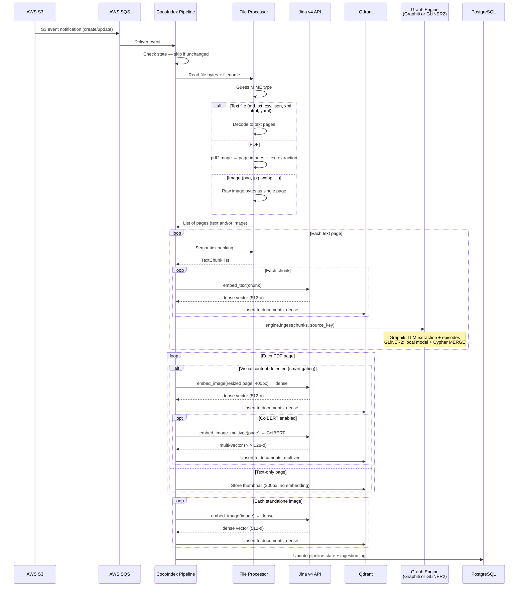
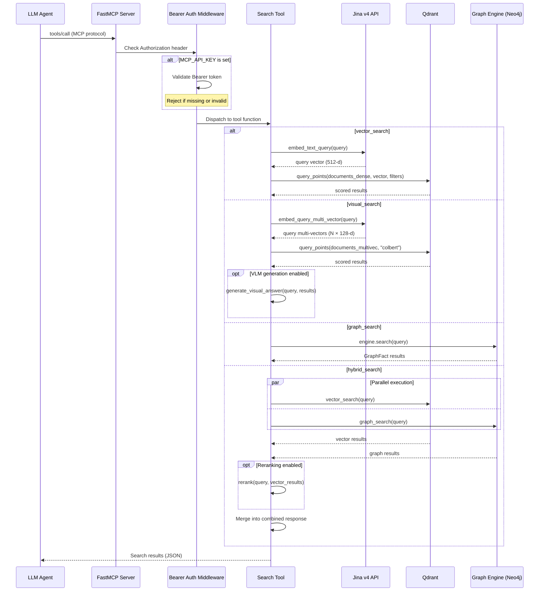
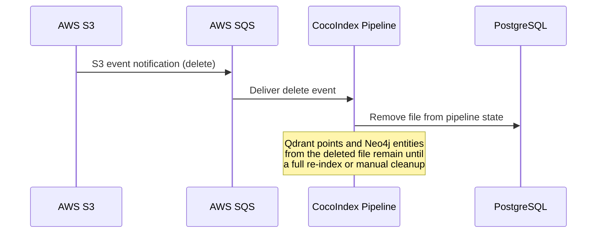

# Data Flow

Three data paths define how documents move through Spektr: **ingest** (S3 to stores), **query** (agent searches), and **delete/invalidation** (removing stale data).

---

## Ingest path

A document lands in S3, triggers an SQS event, and flows through the CocoIndex pipeline into Qdrant and Neo4j.

### Key design decisions in the ingest path

- **Deterministic IDs** -- chunk and point IDs are derived from `{source_file}::p{page}::c{chunk_idx}` via UUID5, making upserts idempotent.
- **Dual embedding for visual content** -- images get both a dense single-vector (for standard NN search) and ColBERT multi-vectors (for layout-aware retrieval). Text chunks get only dense vectors.
- **Pluggable graph engine** -- text chunks are passed to `engine.ingest()`. Graphiti submits them as LLM-processed episodes; GLiNER2 extracts entities and relations locally and writes directly to Neo4j. See [Knowledge Graph](../ingestion/knowledge-graph.md).

---

## Query path

An LLM agent calls one of the four MCP tools. The server embeds the query, searches the relevant store, and returns results.

### Tool summary

| Tool | Backend | Embedding | Best for |
|-|-|-|-|
| `vector_search` | Qdrant `documents_dense` | Dense 512-d | General semantic search over text and images |
| `visual_search` | Qdrant `documents_multivec` | ColBERT 128-d | Charts, diagrams, tables, formatted content |
| `graph_search` | Neo4j via GraphEngine | Graphiti semantic or Neo4j full-text | Entity lookup, facts, relationships |
| `hybrid_search` | Both (parallel) | Dense 512-d | Comprehensive retrieval combining both stores |

### Filtering and reranking

- **`vector_search`** supports optional `content_type` and `source_file` payload filters passed to Qdrant.
- **Reranking** -- when `RERANK_ENABLED=true`, `vector_search` and `hybrid_search` pass results through a reranker before returning.
- **VLM generation** -- when `VLM_GENERATION_ENABLED=true`, `visual_search` generates a natural-language answer from the top visual results and prepends it.

### Error handling

All tools catch exceptions and return a structured error object (`{"error": "...", "query": "..."}`) instead of raising, so agents always get a usable response. `hybrid_search` runs both backends in parallel and reports partial failures in an `errors` list while still returning results from the successful backend.

---

## Delete / invalidation path

When a file is deleted from S3, the SQS event reaches the CocoIndex pipeline. CocoIndex's incremental state tracking detects the deletion and removes the file from its state table.

!!! warning "Stale data after deletion"
    CocoIndex currently tracks deletions in its own state, but does not propagate deletes to Qdrant or Neo4j. Vectors and graph entities from deleted files persist until a full re-index. In Graphiti, temporal metadata (`expired_at`) can mark facts as outdated, but this requires explicit invalidation via the Graphiti API.

### Re-index strategy

To fully clean stale data:

1. Clear Qdrant collections: delete and recreate `documents_dense` and `documents_multivec`
2. Reset Neo4j graph: clear Graphiti episodes or drop and recreate the database
3. Reset CocoIndex state: drop the PostgreSQL ingestion tables
4. Re-run the pipeline: `uv run python -m ingestion.pipeline`
