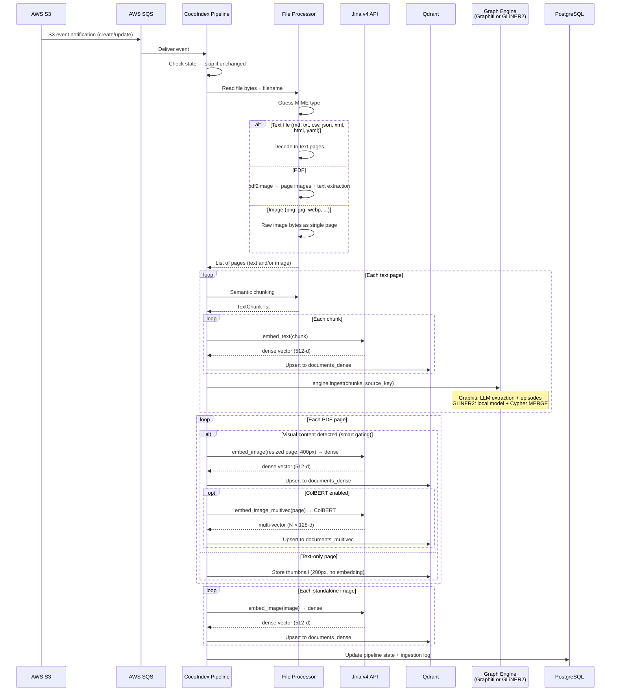
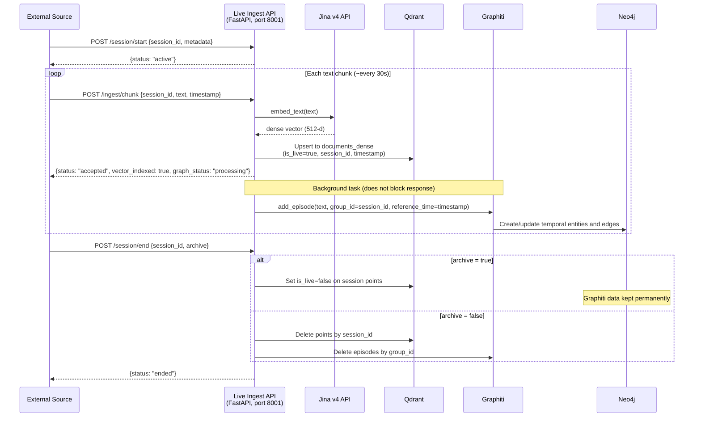
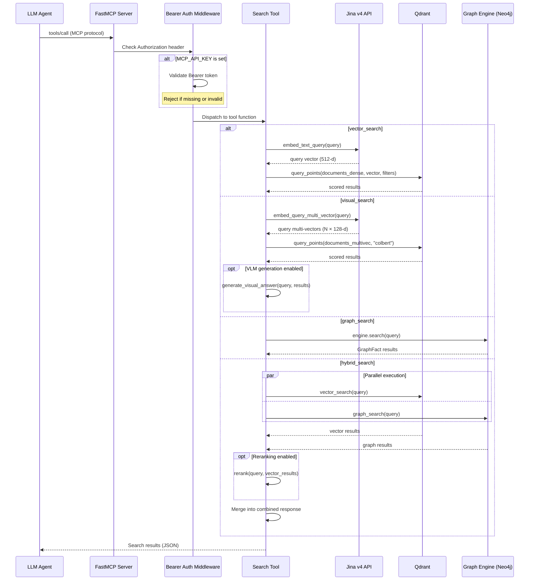
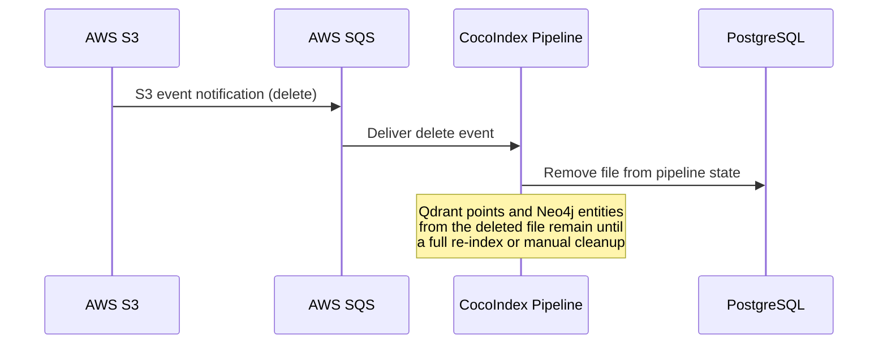

# Data Flow

Four data paths define how data moves through Spektr: **bulk ingest** (S3 to stores), **live ingest** (streaming text to stores), **query** (agent searches), and **delete/invalidation** (removing stale data).

---

## Bulk ingest path (Path A)

A document lands in S3, triggers an SQS event, and flows through the CocoIndex pipeline into Qdrant and Neo4j. When `SCHEMA_INDUCTION_ENABLED=true` and `GRAPH_ENGINE=gliner`, a per-document LLM call proposes domain-specific entity types before GLiNER2 extraction.

### Key design decisions in the bulk ingest path

- **Deterministic IDs** -- chunk and point IDs are derived from `{source_file}::p{page}::c{chunk_idx}` via UUID5, making upserts idempotent.
- **Dual embedding for visual content** -- images get both a dense single-vector (for standard NN search) and ColBERT multi-vectors (for layout-aware retrieval). Text chunks get only dense vectors.
- **Dynamic schema induction** -- when enabled, a single LLM call per document proposes domain-specific entity/relationship types for GLiNER2. Results are cached by content hash. See [Knowledge Graph](../ingestion/knowledge-graph.md).
- **Pluggable graph engine** -- text chunks are passed to `engine.ingest()`. Graphiti submits them as LLM-processed episodes; GLiNER2 extracts entities and relations locally and writes directly to Neo4j. See [Knowledge Graph](../ingestion/knowledge-graph.md).

---

## Live ingest path (Path B)

Streaming text data arrives via HTTP POST to the live ingestion FastAPI server and is indexed into Qdrant immediately. Graphiti temporal graph ingestion runs as a background task.

### Key design decisions in the live ingest path

- **Immediate vector availability** -- the HTTP response returns after Qdrant upsert (~200ms). Graphiti runs in the background (~2-5s per chunk).
- **Session isolation** -- all live data is tagged with `session_id` and `is_live=true`. Graphiti partitions by `group_id=session_id`.
- **Clean lifecycle** -- sessions can be archived (data becomes permanent KB) or discarded (full purge from both Qdrant and Neo4j).
- **Single active session** -- v1 supports one active session at a time to avoid LLM rate limit contention.

---

## Query path

An LLM agent calls one of the six MCP tools. The four search tools (`vector_search`, `visual_search`, `graph_search`, `hybrid_search`) embed the query and search the relevant store. The two listing/inventory tools (`list_documents`, `list_document_chunks`) enumerate what's in the corpus without running a similarity query — useful for agents that need to ground a question against an exhaustive view of the available material before searching. The sequence diagram below covers the search tools; listing tools follow a simpler path (Auth → Tool → Qdrant scroll → results).

### Tool summary

| Tool | Backend | Embedding | Best for |
|-|-|-|-|
| `vector_search` | Qdrant `documents_dense` | Dense (provider-dependent) | General semantic search over text and images |
| `visual_search` | Qdrant `documents_multivec` | ColBERT 128-d | Charts, diagrams, tables, formatted content |
| `graph_search` | Neo4j via GraphEngine | Graphiti semantic or Neo4j full-text | Entity lookup, facts, relationships |
| `hybrid_search` | Both (parallel) | Dense (provider-dependent) | Comprehensive retrieval combining both stores |
| `list_documents` | Qdrant scroll | None | Enumerating distinct source files in the corpus |
| `list_document_chunks` | Qdrant scroll | None | Exhaustive paginated listing of chunks for a given document |

### Filtering and reranking

- **`vector_search`** supports optional `content_type` and `source_file` payload filters passed to Qdrant.
- **Reranking** -- when `RERANK_ENABLED=true`, `vector_search` and `hybrid_search` pass results through a reranker before returning.
- **VLM generation** -- when `VLM_GENERATION_ENABLED=true`, `visual_search` generates a natural-language answer from the top visual results and prepends it.

### Error handling

All tools catch exceptions and return a structured error object (`{"error": "...", "query": "..."}`) instead of raising, so agents always get a usable response. `hybrid_search` runs both backends in parallel and reports partial failures in an `errors` list while still returning results from the successful backend.

---

## Delete / invalidation path

When a file is deleted from S3, the SQS event reaches the CocoIndex pipeline. CocoIndex's incremental state tracking detects the deletion and removes the file from its state table.

!!! warning "Stale data after deletion"
    CocoIndex currently tracks deletions in its own state, but does not propagate deletes to Qdrant or Neo4j. Vectors and graph entities from deleted files persist until a full re-index. In Graphiti, temporal metadata (`expired_at`) can mark facts as outdated, but this requires explicit invalidation via the Graphiti API.

### Re-index strategy

To fully clean stale data:

1. Clear Qdrant collections: delete and recreate `documents_dense` and `documents_multivec`
2. Reset Neo4j graph: clear Graphiti episodes or drop and recreate the database
3. Reset CocoIndex state: drop the PostgreSQL ingestion tables
4. Re-run the pipeline: `uv run python -m ingestion.pipeline`
