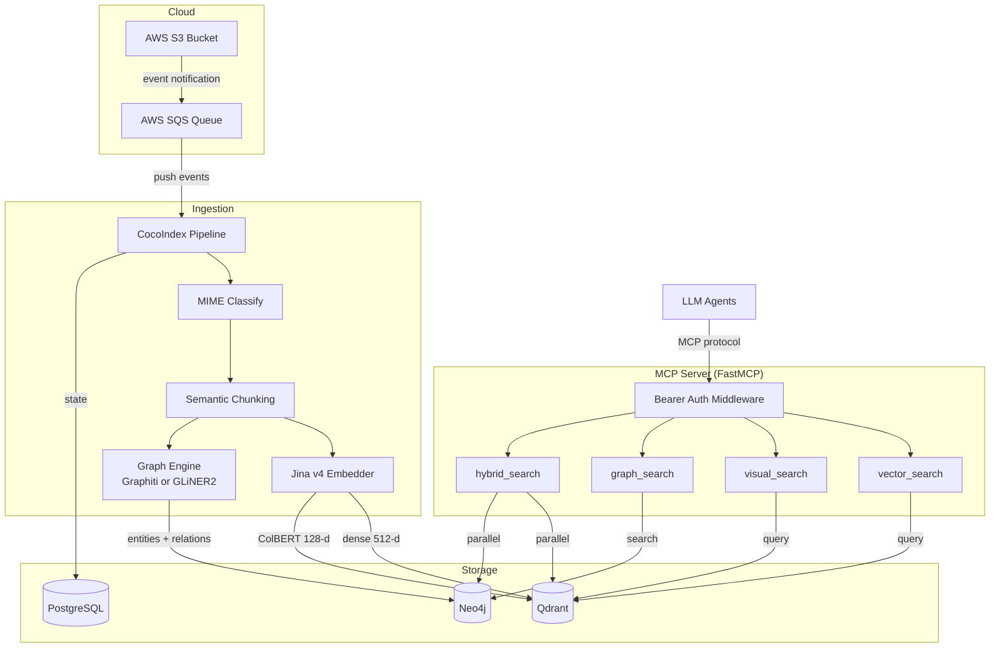

# Architecture Overview

Spektr is a hybrid GraphRAG + multimodal vector search system exposed as an MCP server. Documents flow in from AWS S3, get processed into embeddings and a knowledge graph, and are made searchable by LLM agents through four MCP tools.

## System diagram

## Component roles

| Component | Role | Key details |
|-|-|-|
| **AWS S3** | Document source | PDFs, images, markdown, CSV, JSON, XML, HTML, YAML |
| **AWS SQS** | Event delivery | Receives S3 create/update/delete notifications; provides push-based trigger to pipeline |
| **CocoIndex** | Pipeline orchestrator | Manages incremental state, source reading, and lineage tracking via PostgreSQL |
| **Jina v4 API** | Embedding model | Single model for text and images; produces dense 512-d single-vectors (Matryoshka truncation) and ColBERT 128-d multi-vectors |
| **Qdrant** | Vector store | Two collections: `documents_dense` (single-vector NN search) and `documents_multivec` (ColBERT late interaction) |
| **Neo4j** | Knowledge graph | Entity-relationship graph. Pluggable extraction via `GRAPH_ENGINE`: Graphiti (LLM-based, temporal metadata, deduplication) or GLiNER2 (local 205MB model, zero API cost, ~130ms/chunk on CPU) |
| **PostgreSQL** | Pipeline state | CocoIndex stores flow state and ingestion logs |
| **FastMCP** | MCP server | Registers four search tools; supports SSE and stdio transports; optional Bearer auth middleware |
| **Pydantic AI** | Agent framework | Connects to MCP server, binds tools, orchestrates multi-step retrieval |

## Technology rationale

### Why Jina v4 as the single embedding model?

Jina v4 (`jina-embeddings-v4`) handles text and images in a unified embedding space. This avoids running separate text and vision encoders and keeps the architecture simple. It also provides ColBERT-style multi-vectors for late-interaction retrieval, which is effective for layout-sensitive content like tables and diagrams.

### Why Qdrant with two collections?

- **`documents_dense`** -- standard nearest-neighbor search over 512-d dense vectors (Matryoshka truncation from 2048-d). Works for text chunks and image pages alike. Fast and straightforward.
- **`documents_multivec`** -- ColBERT multi-vector index with 128-d token-level vectors. Enables fine-grained matching that captures spatial layout, useful for visual content that dense single-vectors struggle with.

Separating collections keeps index configurations independent and avoids mixed-mode query overhead.

### Why a pluggable graph engine?

The graph extraction layer is abstracted behind a `GraphEngine` protocol (`ingestion/graph_engine.py`) with two implementations:

- **Graphiti** (`GRAPH_ENGINE=graphiti`, default) -- LLM-based extraction with temporal awareness. Tracks when facts were created and expired. Rich deduplication and relationship discovery, but each chunk triggers LLM API calls (~29 min for a 74-chunk PDF).
- **GLiNER2** (`GRAPH_ENGINE=gliner`) -- local 205MB model doing NER + relation extraction in a single forward pass. Zero API cost, ~5-15 seconds for the same PDF. Entities and typed relationships are written directly to Neo4j via Cypher MERGE. Matches GPT-4o NER quality (0.59 F1 on CrossNER).

Both engines implement `ingest()`, `search()`, and `close()`, and return the same `GraphFact` model. Pipeline and search tools are engine-agnostic — swap engines via one env var with zero code changes.

### Why CocoIndex?

CocoIndex provides incremental processing with state tracking. When a file changes in S3, only that file is re-processed. It also handles source abstraction (S3 or local filesystem) and exports ingestion logs to PostgreSQL for observability.

### Why FastMCP?

FastMCP is a lightweight MCP server framework that supports both SSE (for network clients) and stdio (for local agent processes). It has built-in middleware support, which Spektr uses for Bearer token authentication.

## Security model

- **Bearer auth middleware** -- when `MCP_API_KEY` is set, the `BearerAuthMiddleware` rejects unauthenticated `tools/call` requests. When empty, auth is disabled (development mode).
- **Credentials** -- all secrets live in `.env` (gitignored). See [Environment Variables](../configuration/environment.md).
- **Network** -- infrastructure services (Qdrant, Neo4j, PostgreSQL) are not exposed publicly in production; only the MCP server port is accessible to agents.
