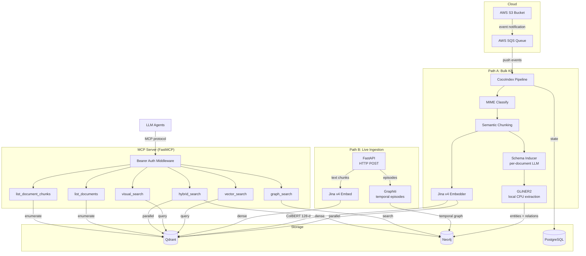

# Architecture Overview

Spektr is a hybrid GraphRAG + multimodal vector search system exposed as an MCP server. It supports two ingestion paths: a **bulk pipeline** (CocoIndex with a pluggable graph engine — Graphiti by default, GLiNER2 opt-in) for batch document processing from local filesystem, S3, or SharePoint, and a **live ingestion** endpoint for streaming text data with temporal tracking via Graphiti. Both paths write to shared Qdrant and Neo4j stores, and are made searchable by LLM agents through six session-aware MCP tools.

## System diagram

## Component roles

| Component | Role | Key details |
|-|-|-|
| **AWS S3** | Document source (Path A) | PDFs, images, markdown, CSV, JSON, XML, HTML, YAML |
| **AWS SQS** | Event delivery (Path A) | Receives S3 create/update/delete notifications; provides push-based trigger to pipeline |
| **CocoIndex** | Pipeline orchestrator (Path A) | Manages incremental state, source reading, and lineage tracking via PostgreSQL |
| **FastAPI** | Live ingestion server (Path B) | HTTP POST endpoint for streaming text chunks; session lifecycle management (start/ingest/end) |
| **Schema Inducer** | Dynamic schema (Path A) | Per-document LLM call proposes domain-specific entity types for GLiNER2; cached by content hash |
| **Jina v4 API** | Embedding model | Single model for text and images; produces dense 512-d single-vectors (Matryoshka truncation) and ColBERT 128-d multi-vectors. Used by both paths |
| **Qdrant** | Vector store | Two collections: `documents_dense` (single-vector NN search) and `documents_multivec` (ColBERT late interaction). Both paths write to `documents_dense`; live data tagged with `session_id` and `is_live` |
| **Neo4j** | Knowledge graph | Dual-engine: GLiNER2 (Path A, schema-driven CPU extraction) writes flat entities; Graphiti (Path B, LLM-based) writes temporal episodes with fact evolution tracking. Both coexist in the same instance |
| **PostgreSQL** | Pipeline state | CocoIndex stores flow state and ingestion logs |
| **FastMCP** | MCP server | Registers six tools (four search + two listing/inventory); supports streamable-http (default), SSE (legacy), and stdio transports; optional Bearer auth middleware |
| **Pydantic AI** | Agent framework | Connects to MCP server, binds tools, orchestrates multi-step retrieval |

## Technology rationale

### Why Jina v4 as the single embedding model?

Jina v4 (`jina-embeddings-v4`) handles text and images in a unified embedding space. This avoids running separate text and vision encoders and keeps the architecture simple. It also provides ColBERT-style multi-vectors for late-interaction retrieval, which is effective for layout-sensitive content like tables and diagrams.

### Why Qdrant with two collections?

- **`documents_dense`** -- standard nearest-neighbor search over 512-d dense vectors (Matryoshka truncation from 2048-d). Works for text chunks and image pages alike. Fast and straightforward.
- **`documents_multivec`** -- ColBERT multi-vector index with 128-d token-level vectors. Enables fine-grained matching that captures spatial layout, useful for visual content that dense single-vectors struggle with.

Separating collections keeps index configurations independent and avoids mixed-mode query overhead.

### Why a pluggable graph engine?

The graph extraction layer is abstracted behind a `GraphEngine` protocol (`ingestion/graph_engine.py`) with two implementations:

- **Graphiti** (`GRAPH_ENGINE=graphiti`, default) -- LLM-based extraction with temporal awareness. Tracks when facts were created and expired. Rich deduplication and relationship discovery, but each chunk triggers LLM API calls (~29 min for a 74-chunk PDF). **Primary engine for Path B** (live ingestion), where temporal episodic memory is essential.
- **GLiNER2** (`GRAPH_ENGINE=gliner`) -- local 205MB model doing NER + relation extraction in a single forward pass. Zero API cost, ~5-15 seconds for the same PDF. Entities and typed relationships are written directly to Neo4j via Cypher MERGE. Matches GPT-4o NER quality (0.59 F1 on CrossNER). **Primary engine for Path A** (bulk KB), enhanced with dynamic schema induction.

Both engines implement `ingest()`, `search()`, and `close()`, and return the same `GraphFact` model. The bulk pipeline and search tools are engine-agnostic — swap engines via one env var with zero code changes.

> **Important:** The `GRAPH_ENGINE` setting only controls the **bulk ingestion path** (Path A). Live streaming (Path B) **always uses Graphiti directly** — it bypasses the `GraphEngine` abstraction entirely, calling `get_graphiti()` and `client.add_episode()` for temporal episodic memory. This means a working LLM API key and Graphiti service are required for live ingestion even when `GRAPH_ENGINE=gliner`.

### Why dynamic schema induction?

GLiNER2's extraction quality is directly tied to schema description richness. The base schema (14 entity types, 12 relationship types in `constants.py`) covers common domains, but specialized documents (legal contracts, financial reports, medical records) benefit from domain-specific types. The schema inducer makes a single cheap LLM call per document (~$0.001) to propose additional entity and relationship types, which are merged on top of the base schema. Results are cached by content hash to avoid redundant LLM calls for similar documents.

### Why a separate live ingestion path?

The bulk pipeline (CocoIndex) is batch-oriented — it manages incremental state, reads from S3/filesystem, and processes multimodal content. Live streaming data has fundamentally different requirements: push-based delivery (HTTP POST), sub-second vector indexing, temporal episodic memory, and session lifecycle management. A lightweight FastAPI endpoint on a separate port serves this path without adding complexity to the batch pipeline.

### Why CocoIndex?

CocoIndex provides incremental processing with state tracking. When a file changes in S3, only that file is re-processed. It also handles source abstraction (S3 or local filesystem) and exports ingestion logs to PostgreSQL for observability.

### Why FastMCP?

FastMCP is a lightweight MCP server framework that supports streamable-http (the modern default for network clients), SSE (legacy long-lived stream — kept for older clients), and stdio (for subprocess agent processes). It has built-in middleware support, which Spektr uses for Bearer token authentication.

### MCP tools

Six tools are registered. Four are search; two are listing/inventory helpers used by agents to enumerate what's in the corpus before querying.

| Tool | Category |
|-|-|
| `vector_search` | Search |
| `visual_search` | Search |
| `graph_search` | Search |
| `hybrid_search` | Search |
| `list_documents` | Listing/Inventory |
| `list_document_chunks` | Listing/Inventory |

## Security model

- **Bearer auth middleware** -- when `MCP_API_KEY` is set, the `BearerAuthMiddleware` rejects unauthenticated `tools/call` requests. When empty, auth is disabled (development mode).
- **Credentials** -- all secrets live in `.env` (gitignored). See [Environment Variables](../configuration/environment.md).
- **Network** -- infrastructure services (Qdrant, Neo4j, PostgreSQL) are not exposed publicly in production; only the MCP server port is accessible to agents.
