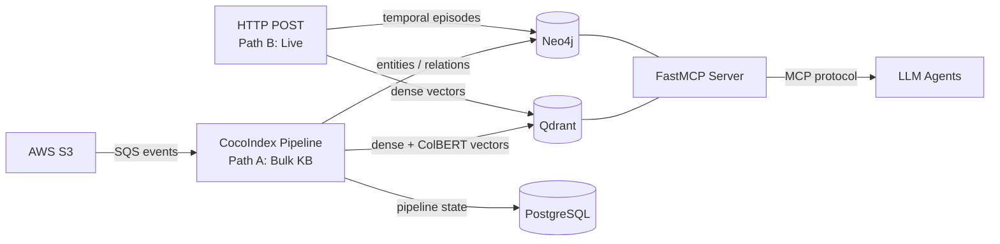

# Spektr

**RAG-as-MCP-Server** -- automatically syncs documents from AWS S3 into a dual knowledge store (Qdrant vector DB + Neo4j temporal knowledge graph via Graphiti) and exposes search tools to LLM agents through the [Model Context Protocol](https://modelcontextprotocol.io/). No human-facing UI; primary consumers are Pydantic AI agents, Claude Code, and custom LLM frameworks.

## Features

- **Dual-path ingestion** -- batch pipeline for bulk documents (CocoIndex + GLiNER2) and real-time HTTP endpoint for streaming text data with temporal tracking (Graphiti episodes)
- **Dual retrieval** -- vector similarity (Qdrant) and knowledge graph (Neo4j) in a single server
- **Session-aware search** -- MCP tools accept an optional `session_id` to combine live session context with bulk KB results
- **Multimodal embeddings** -- Jina v4 produces dense 512-d vectors for text and images (Matryoshka truncation), plus ColBERT 128-d multi-vectors for layout-aware visual search
- **Dynamic schema induction** -- per-document LLM call proposes domain-specific entity types for GLiNER2, improving extraction quality across diverse document types
- **Automatic sync** -- CocoIndex pipeline watches S3 via SQS event notifications; new, updated, and deleted files are processed incrementally
- **Four MCP search tools** -- `vector_search`, `visual_search`, `graph_search`, `hybrid_search`
- **Bearer auth middleware** -- optional token-based protection on `tools/call` requests
- **Pluggable graph engine** -- choose Graphiti (LLM-based, temporal awareness) or GLiNER2 (local CPU, zero API cost) via `GRAPH_ENGINE` setting

## Architecture



## Quick start

```bash
# Infrastructure
docker compose up -d
./scripts/wait-for-services.sh

# Copy and fill environment variables
cp .env.example .env

# Ingest documents (bulk KB)
uv run python -m ingestion.pipeline

# Start the MCP server
uv run python -m server.mcp_server

# Start the live ingestion server (optional, for streaming text data)
uv run uvicorn ingestion.live_ingest:app --port 8001
```

See [Local Development](deployment/local-development.md) for the full setup guide.

## Documentation map

| Section | Description |
|-|-|
| [Architecture Overview](architecture/overview.md) | System diagram, component roles, technology rationale |
| [Data Flow](architecture/data-flow.md) | Bulk ingest, live ingest, query, and delete paths with sequence diagrams |
| [Ingestion Pipeline](ingestion/overview.md) | Bulk KB pipeline (CocoIndex + schema induction) and live streaming ingestion |
| [MCP Server](server/overview.md) | Tool registration, transport, authentication |
| [Search Tools](server/search-tools.md) | Per-tool reference with session-aware search |
| [Agent](agent/overview.md) | Pydantic AI agent and HTTP API |
| [Configuration](configuration/environment.md) | Environment variables and infrastructure setup |
| [Production Deployment](deployment/production.md) | Fully containerized deploy on a single VM (Docker Compose + Caddy) |
| [AWS Setup](deployment/aws-setup.md) | S3 event notifications, SQS, IAM |

## Stack

| Component | Technology |
|-|-|
| Language | Python 3.13 |
| Package manager | uv |
| Ingestion pipeline | CocoIndex |
| Embeddings | Jina v4 API (dense 512-d + ColBERT 128-d) |
| Vector store | Qdrant v1.13 |
| Knowledge graph | Neo4j 5.26 + Graphiti or GLiNER2 (pluggable via `GRAPH_ENGINE`) |
| State DB | PostgreSQL 17.2 |
| MCP server | FastMCP (SSE + stdio) |
| Agent framework | Pydantic AI |
| Cloud | AWS S3 + SQS |
