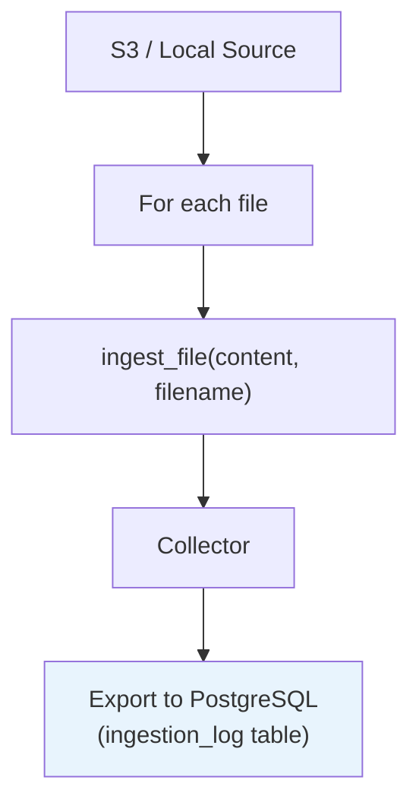
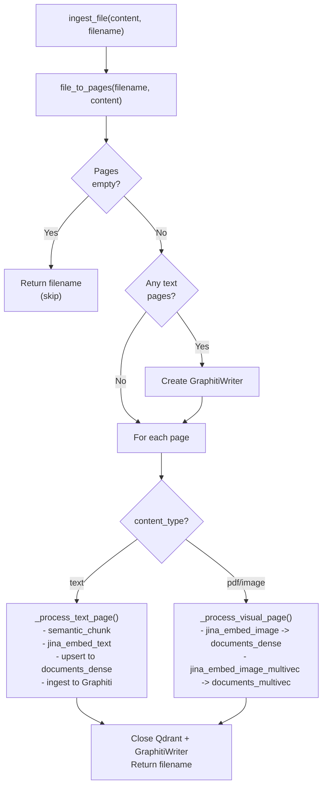

# CocoIndex Pipeline

The ingestion pipeline is defined as a **CocoIndex flow** that manages source reading, incremental state tracking, and file processing orchestration. All embedding, storage, and graph operations happen inside a custom `ingest_file` op.

**Source:** `ingestion/pipeline.py`, `ingestion/jina_cocoindex_ops.py`

## Flow Definition

```python
@cocoindex.flow_def(name="RagIngestion")
def rag_ingestion_flow(flow_builder, data_scope) -> None
```

### Source Selection

The pipeline auto-switches between S3 and local filesystem based on configuration:

| Condition | Source | Filename Field |
|-|-|-|
| `s3_bucket_name` AND `s3_sqs_queue_url` set | `AmazonS3` (with SQS notifications) | `key` |
| Otherwise | `LocalFile` (reads from `documents/` dir) | `filename` |

Both sources use `binary=True` and filter to supported file patterns:

```
*.pdf *.png *.jpg *.jpeg *.gif *.bmp *.webp
*.md *.txt *.csv *.json *.xml *.html *.yaml *.yml
```

### Pipeline Structure



For each file in the source:

1. `content` bytes and `filename` are passed to `ingest_file`
2. The result is collected alongside the filename
3. The collector exports to a PostgreSQL table (`ingestion_log`) with `filename` as primary key

## `ingest_file` Custom Op

The core processing op, registered as a CocoIndex function:

```python
@cocoindex.op.function()
def ingest_file(content: bytes, filename: str) -> str
```

Returns the filename as a passthrough for CocoIndex lineage tracking.

### Step-by-step walkthrough



1. **Classify**: `file_to_pages(filename, content)` detects MIME type and creates `Page` objects
2. **Check**: If no pages extracted, log warning and return early
3. **Init**: If any text pages exist, create a `GraphitiWriter` instance
4. **Process each page**:
    - **Text pages** (`_process_text_page`):
        - `semantic_chunk()` splits text into chunks
        - Each chunk is embedded via `embed_text()` (dense 512d)
        - Dense vectors are upserted to `documents_dense` collection
        - Chunks are ingested as Graphiti episodes for entity extraction
    - **Visual pages** (`_process_visual_page`, gated by `IMAGE_EMBED_STRATEGY`):
        - Image resized to `IMAGE_EMBED_MAX_PX` (400px default) before embedding
        - `embed_image()` produces a dense 512d vector -> `documents_dense`
        - `embed_multi_vector()` produces ColBERT 128d token vectors -> `documents_multivec`
    - **Text-only PDF pages** (`_store_page_thumbnail`):
        - 200px thumbnail stored in Qdrant payload as `page_thumbnail_b64` (no embedding cost)
5. **Cleanup**: Close Qdrant client and GraphitiWriter in `finally` block
6. **Log**: Duration logged in milliseconds

### ID Generation

| Function | Purpose | Strategy |
|-|-|-|
| `_make_chunk_id(source, page, idx)` | Chunk identifier | `{source}::p{page}::c{idx}` |
| `_make_point_id(key)` | Qdrant point UUID | `uuid5(NAMESPACE_URL, key)` -- deterministic for idempotent upserts |

## State Tracking

CocoIndex tracks pipeline state in **PostgreSQL** (`settings.database_url`). The flow exports an `ingestion_log` table with `filename` as the primary key, enabling:

- **Incremental processing**: Only new/changed files are re-processed
- **Lineage tracking**: Each file's processing result is recorded
- **S3 event-driven updates**: SQS notifications trigger re-processing of changed objects

## `_run_async` Helper

CocoIndex ops are synchronous, but the embedder and Graphiti writer are async. The `_run_async` helper bridges this gap:

```python
def _run_async(coro):
    try:
        asyncio.get_running_loop()
    except RuntimeError:
        return asyncio.run(coro)      # No event loop -> create one
    # Already in event loop -> run in a thread
    with ThreadPoolExecutor(max_workers=1) as pool:
        return pool.submit(asyncio.run, coro).result()
```

This pattern appears in both `pipeline.py` and `jina_cocoindex_ops.py`. It handles two cases:

1. **No running event loop**: Creates one with `asyncio.run()` (typical case)
2. **Inside an existing event loop**: Spawns a new thread with its own event loop to avoid nested `asyncio.run()` errors

## `run_pipeline()`

Entry point that orchestrates the full pipeline lifecycle:

1. `cocoindex.init()` -- initialize CocoIndex runtime
2. Provision Qdrant collections (`ensure_collections`)
3. Create Neo4j schema constraints (`create_neo4j_schema`)
4. Open and set up the `RagIngestion` flow
5. `cocoindex.update_all_flows()` -- process all pending files
6. Log total duration

```bash
uv run python -m ingestion.pipeline
```

## CocoIndex Ops

The `jina_cocoindex_ops.py` module registers embedding functions as CocoIndex ops. See [Embeddings](embeddings.md#cocoindex-ops-wrapper) for details.

See also: [Pipeline Overview](overview.md) | [Embeddings](embeddings.md) | [Knowledge Graph](knowledge-graph.md) | [Architecture Data Flow](../architecture/data-flow.md)
