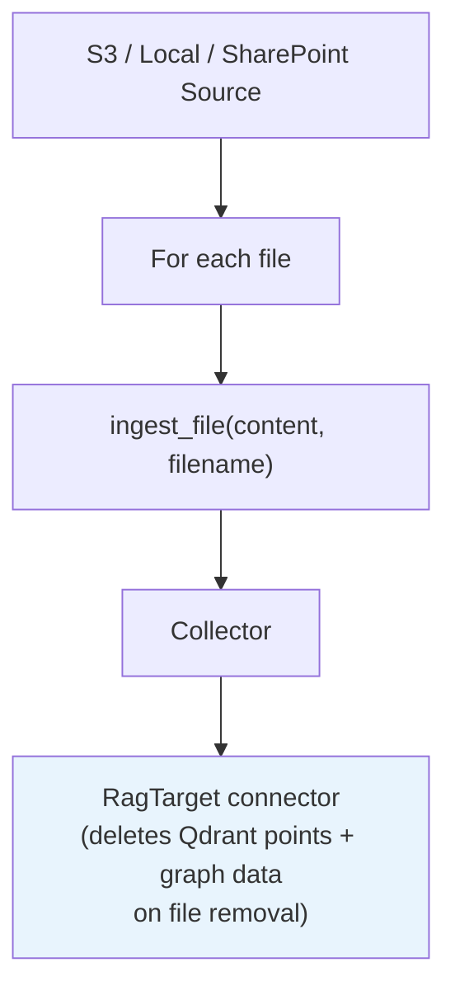
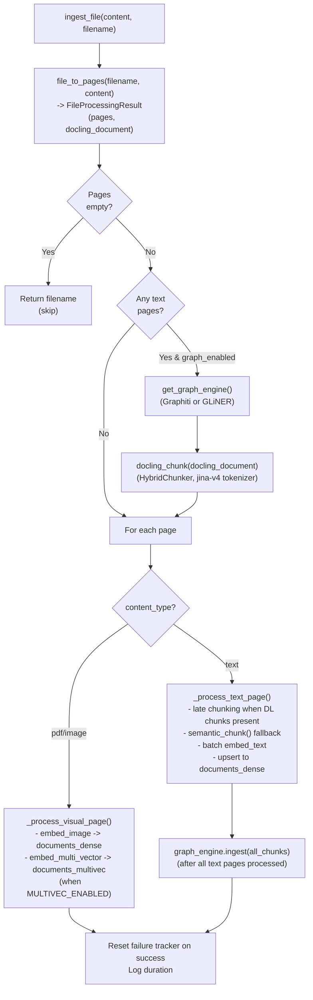

# CocoIndex Pipeline

The ingestion pipeline is defined as a **CocoIndex flow** that manages source reading, incremental state tracking, and file processing orchestration. All embedding, storage, and graph operations happen inside a custom `ingest_file` op.

**Source:** `ingestion/pipeline.py`, `ingestion/cocoindex_ops.py`

## Flow Definition

```python
@cocoindex.flow_def(name="RagIngestion")
def rag_ingestion_flow(flow_builder, data_scope) -> None
```

### Source Selection

The pipeline reads `DOCUMENT_SOURCE` (`local`, `s3`, or `sharepoint`) to pick a source:

|`DOCUMENT_SOURCE`|Source|Filename field|
|-|-|-|
|`local`|`LocalFile` reading `LOCAL_DOCUMENTS_PATH` (default `documents/`)|`filename`|
|`s3`|`AmazonS3` + SQS change stream (`S3_SQS_QUEUE_URL`)|`filename`|
|`sharepoint`|`LocalFile` reading the local mirror populated by `task sharepoint-sync` (under `LOCAL_DOCUMENTS_PATH`)|`filename`|

Both LocalFile-backed sources and `AmazonS3` expose the row key as `filename` — the S3 source does **not** use `key`. The `sharepoint` source is a thin adapter: the `sharepoint-sync` task mirrors a SharePoint drive into the local documents path, and CocoIndex watches that directory like any other local source. See [S3 + SQS setup](s3-sqs-setup.md) for the AWS wiring and gotchas.

All sources use `binary=True` and filter to supported file patterns (recursive, `**/*.ext`):

```
**/*.pdf **/*.png **/*.jpg **/*.jpeg **/*.gif **/*.bmp **/*.webp
**/*.md **/*.txt **/*.csv **/*.json **/*.xml **/*.html **/*.yaml **/*.yml
```

The `**/` prefix is required because the SharePoint syncer mirrors folder structure; bare `*.pdf` would only match a single path segment.

### Pipeline Structure



For each file in the source:

1. `content` bytes and `filename` are passed to `ingest_file`
2. The result is collected alongside the filename
3. The collector exports through `RagTarget` (a CocoIndex `target_connector`). Upserts are no-ops at the connector level — `ingest_file` already wrote everything to Qdrant and Neo4j. The connector's job is **delete handling**: when CocoIndex sees a file disappear from the source, the connector wipes its Qdrant points and graph data.

## `ingest_file` Custom Op

The core processing op, registered as a CocoIndex function:

```python
@cocoindex.op.function()
def ingest_file(content: bytes, filename: str) -> str
```

Returns the filename as a passthrough for CocoIndex lineage tracking.

### Step-by-step walkthrough



1. **Classify**: `file_to_pages(filename, content)` returns a `FileProcessingResult` with `pages` and an optional `docling_document` for HybridChunker.
2. **Check**: If no pages extracted, log warning and return early.
3. **Init graph engine**: If any text pages exist and `GRAPH_ENABLED=true`, obtain the singleton via `get_graph_engine()` (returns `GraphitiEngine` or `GLiNEREngine` based on `GRAPH_ENGINE`). See [Knowledge Graph](knowledge-graph.md).
4. **Compute Docling chunks once**: If `docling_document` is present, `docling_chunk()` runs `HybridChunker` on the whole document, producing `TextChunk`s with `contextualized_text` (heading-prefixed). These are filtered per page during text processing and enable Jina v4 late-chunking.
5. **Process each page**:
    - **Text pages** (`_process_text_page`):
        - Use Docling chunks for this page if available (with `late_chunking=True`); fall back to `semantic_chunk()` otherwise.
        - Batch-embed all chunks in a single API call via `embedder.embed_text(...)`.
        - Upsert points to `documents_dense` (payload includes `embedder_model`, `embedder_dim`, `text_content`, `contextualized_text` when present).
        - Collect chunks into a single list for bulk graph ingestion at the end.
    - **Visual pages** (`_process_visual_page`, gated by `IMAGE_EMBED_STRATEGY`):
        - `embedder.embed_image()` -> dense vector -> `documents_dense`.
        - When `MULTIVEC_ENABLED=true`, `embedder.embed_multi_vector()` -> ColBERT 128d vectors -> `documents_multivec`.
        - When `VLM_GENERATION_ENABLED=true`, the page is captioned by an LLM and the caption is sent to the graph engine.
6. **Bulk graph ingest**: After all text pages have produced chunks, `_ingest_to_graph_with_schema()` calls `engine.ingest(chunks, source_key, schema=...)`. For GLiNER with schema induction enabled, `SchemaInducer` runs on the first 3 chunks to propose a per-document schema before extraction.
7. **Concurrency split**: Text tasks run with `Semaphore(2)` via `asyncio.gather`; image tasks run sequentially because each image is heavy in TPM cost.
8. **Cleanup**: The embedder's HTTP client is closed in a `finally` block. The graph engine singleton is closed once at end of `run_pipeline`.

### ID Generation

|Function|Purpose|Strategy|
|-|-|-|
|`_make_chunk_id(source, page, idx)`|Chunk identifier|`{source}::p{page}::c{idx}`|
|`_make_point_id(key)`|Qdrant point UUID|`uuid5(NAMESPACE_URL, key)` -- deterministic for idempotent upserts|

## Failure Semantics

`ingest_file` is wrapped in a try/except that uses a persistent SQLite-backed counter (`ingestion/_failure_tracker.py`, DB at `state/ingestion_failures.db`):

1. **Per-file timeout**: every call runs under `run_async(..., timeout=PIPELINE_TIMEOUT)` (default 3600s). On expiry a `TimeoutError` is raised.
2. **On any exception (timeout or other)**: the failure tracker increments the file's count.
3. **Retry mode** — if `count < PIPELINE_MAX_RETRIES` (default `3`), the exception is **re-raised**. CocoIndex sees the failure, leaves the tracking row out, and will retry the file on the next pipeline run.
4. **Poison-pill** — once `count >= PIPELINE_MAX_RETRIES`, the exception is **swallowed** with a `CRITICAL` log line. `ingest_file` returns the filename normally, so CocoIndex marks the file processed and the rest of the batch proceeds. To retry a poisoned file, delete its row from `state/ingestion_failures.db` and the corresponding row from CocoIndex's tracking table.
5. **On success**: the tracker resets the count for that file.

This contract keeps a single bad file from blocking an entire batch while still surfacing transient failures for retry. `scripts/doctor.py` will flag drift between CocoIndex tracking and Qdrant, and `task doctor-fix` cleans up orphans.

## State Tracking

CocoIndex tracks pipeline state in **PostgreSQL** (`settings.database_url`) for incremental processing and lineage. Source events (SQS for S3, filesystem watch for local/sharepoint) trigger re-processing of changed objects.

## `run_async` Helper

CocoIndex ops are synchronous, but the embedder and graph engine are async. `ingestion/_utils.run_async` bridges this gap with optional timeout support:

```python
from ingestion._utils import run_async

result = run_async(coro, timeout=settings.pipeline_timeout)
```

It creates a fresh event loop per call (and embedders use `_ensure_loop_resources()` to recreate loop-bound HTTP clients/semaphores accordingly). The same helper is used by `cocoindex_ops.py` to wrap the embedder for the few CocoIndex ops that still expose embeddings directly.

## `run_pipeline()`

Entry point that orchestrates the full pipeline lifecycle:

1. `setup_observability()` — enable Logfire/OTel/structured logging
2. Export AWS credentials to `os.environ` when `DOCUMENT_SOURCE=s3` (CocoIndex's Rust-based S3 SDK reads `os.environ` directly; pydantic-settings does not populate it)
3. `cocoindex.init()` — initialize CocoIndex runtime
4. Provision Qdrant collections (`ensure_collections`)
5. Create Neo4j schema constraints (`create_neo4j_schema`)
6. `cocoindex.setup_all_flows()`
7. `cocoindex.update_all_flows_async()` — process pending files, blocking in live mode
8. `close_graph_engine()` if the engine was initialised

```bash
task ingest          # one-shot batch: process everything, exit
task ingest-live     # watch SQS / filesystem continuously
```

Live mode (`--live`) passes `live_mode=True` to `cocoindex.update_all_flows_async`, which blocks on SQS (for S3) or inotify (for local/sharepoint mirror). Use Ctrl-C to stop.

### AWS credentials plumbing

When `DOCUMENT_SOURCE=s3`, `run_pipeline` exports `AWS_ACCESS_KEY_ID`, `AWS_SECRET_ACCESS_KEY`, `AWS_REGION`, `AWS_DEFAULT_REGION`, and `AWS_ENDPOINT_URL` from Settings into `os.environ` before `cocoindex.init()`. This is because pydantic-settings reads `.env` into the `Settings` object but does **not** populate process env; CocoIndex's Rust-based S3 SDK reads `os.environ` directly. Without this export the pipeline fails with `A region must be set when sending requests to S3.`

## CocoIndex Ops

`ingestion/cocoindex_ops.py` registers a few embedding functions as CocoIndex ops (`op_embed_text`, `op_embed_image`, `op_embed_image_multivec`). They are not used by the main `ingest_file` flow today but are kept for ad-hoc CocoIndex sub-flows. See [Embeddings](embeddings.md#cocoindex-ops-wrapper) for details.

See also: [Pipeline Overview](overview.md) | [Embeddings](embeddings.md) | [Knowledge Graph](knowledge-graph.md) | [Architecture Data Flow](../architecture/data-flow.md)
