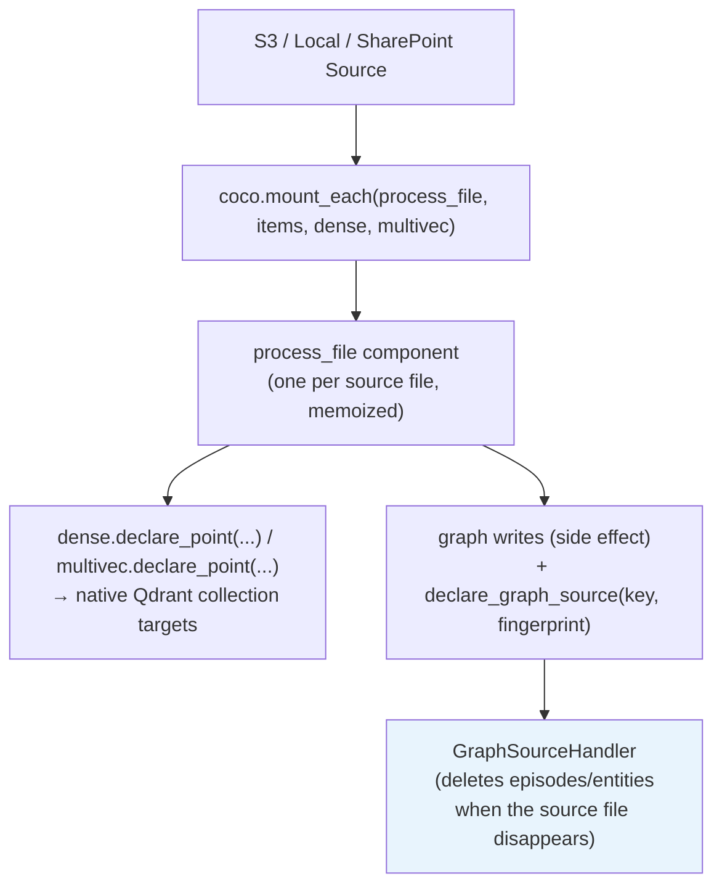
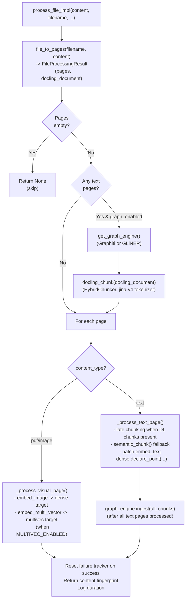

# CocoIndex Pipeline

The ingestion pipeline is a **CocoIndex app** that manages source reading, incremental state tracking, and file processing orchestration. All embedding, storage, and graph operations happen inside a per-file processing component.

**Source:** `ingestion/app.py`, `ingestion/pipeline.py`, `ingestion/page_processor.py`, `ingestion/qdrant_target.py`, `ingestion/graph_target.py`, `ingestion/runner.py`, `ingestion/sqs_trigger.py`

## App Definition

```python
# ingestion/app.py
APP_NAME = "RagIngestion"

@coco.fn
async def app_main() -> None:
    dense = await mount_dense_target()
    multivec = await mount_multivec_target() if settings.multivec_enabled else None
    await coco.mount_each(process_file, _source_items(), dense, multivec)

def build_app() -> coco.App[Any, Any]:
    return coco.App(
        coco.AppConfig(
            name=APP_NAME,
            max_inflight_components=settings.pipeline_max_concurrent_files,
        ),
        app_main,
    )
```

`max_inflight_components` bounds how many files are processed at once. CocoIndex's own default is `1024`, which would fan straight past the embedding providers' rate limits, so it is pinned to `PIPELINE_MAX_CONCURRENT_FILES` (default `4`).

A `@coco.lifespan` hook (`coco_lifespan`) provides the shared resources for a run:

- points CocoIndex at its state directory (`builder.settings.db_path = COCOINDEX_DB_PATH`)
- provides the `QdrantClient` under the `spektr/qdrant` context key
- provides **one** `Embedder` for the whole run under `spektr/embedder` (v1 is async end to end, so there is no longer a fresh event loop — and therefore a fresh embedder — per file)
- provides an `aiobotocore` S3 client under `spektr/s3` when `DOCUMENT_SOURCE=s3`
- on shutdown, logs estimated embedder token usage and closes the embedder

### Source Selection

The pipeline reads `DOCUMENT_SOURCE` (`local`, `s3`, or `sharepoint`) to pick a source:

|`DOCUMENT_SOURCE`|Source|Live watcher?|
|-|-|-|
|`local`|`localfs.walk_dir(LOCAL_DOCUMENTS_PATH, recursive=True, live=True)`|Yes — a real filesystem watcher|
|`s3`|`amazon_s3.list_objects(client, S3_BUCKET_NAME, prefix=S3_PREFIX)`|No — scan only; live mode is driven externally by `ingestion/sqs_trigger.py`|
|`sharepoint`|The same `localfs` walker, over the mirror `task sharepoint-sync` populates under `LOCAL_DOCUMENTS_PATH`|Yes|

The logical key for each file — what lands in the `source_file` payload field — is computed by `source_key()` in `ingestion/app.py`. It is always a path *relative to the source root* (`arxiv.pdf`, `specs/api.md`), never absolute. `amazon_s3` already yields prefix-stripped relative paths; the `localfs` walker yields the walked path, which is made relative to `LOCAL_DOCUMENTS_PATH`. Every Qdrant payload, the delete path, `list_documents` and the eval fixtures are keyed on this value.

The `sharepoint` source is a thin adapter: the `sharepoint-sync` task mirrors a SharePoint drive into the local documents path, and CocoIndex watches that directory like any other local source. See [S3 + SQS setup](s3-sqs-setup.md) for the AWS wiring and gotchas.

All sources filter to supported file patterns via `PatternFilePathMatcher(included_patterns=SUPPORTED_PATTERNS)` (recursive, `**/*.ext`):

```
**/*.pdf **/*.png **/*.jpg **/*.jpeg **/*.gif **/*.bmp **/*.webp
**/*.md **/*.txt **/*.csv **/*.json **/*.xml **/*.html **/*.yaml **/*.yml
```

The `**/` prefix is required because the SharePoint syncer mirrors folder structure; bare `*.pdf` would only match a single path segment.

### Pipeline Structure



For each file in the source, `coco.mount_each` mounts one `process_file` component:

```python
@coco.fn(memo=True)
async def process_file(file: FileLike[Any], dense: Any, multivec: Any) -> None:
    filename = source_key(file)
    content = await file.read()
    embedder = coco.use_context(EMBEDDER)
    fingerprint = await process_file_impl(content, filename, dense=dense,
                                          multivec=multivec, embedder=embedder)
    if fingerprint is not None:
        declare_graph_source(filename, fingerprint)
```

Because the component is memoized, unchanged files (with unchanged code) skip re-execution entirely and their previously declared points stay reconciled as-is.

### Targets

Two kinds of target state are declared per file.

**Qdrant points** go through the native `cocoindex.connectors.qdrant` connector, wired in `ingestion/qdrant_target.py`. Both collection targets are mounted with `managed_by=ManagedBy.USER`, which carries three consequences worth knowing:

- **CocoIndex never creates, replaces or drops the collections.** `ingestion/qdrant_setup.py::ensure_collections` remains the sole provisioning authority. This is load-bearing: a collection *replacement* — which any change to the declared vector schema would otherwise trigger — would drop every point in `documents_dense`, including Path B's live-session points that share the collection.
- **Deletion is per point id**, issued as explicit id lists. CocoIndex never enumerates the collection, so points it did not declare (again: Path B's live sessions) are invisible to it, and there is no orphan sweep.
- **Nothing is written until the whole component succeeds.** Points are declared, then flushed by CocoIndex across the reconcile batch, so a mid-file failure can no longer leave half a document in Qdrant.

The declared schemas still mirror `qdrant_setup.py` exactly (named `dense` + `sparse` (IDF) vectors on `documents_dense`; a `colbert` MaxSim multi-vector on `documents_multivec`) so that they never describe something other than reality.

**Graph data** is *not* a declared target state — Graphiti is an episodic writer that appends episodes with validity intervals, which does not fit reconciliation of declared state. Graph writes therefore stay side effects inside `process_file_impl`. What CocoIndex is used for is the one thing a side effect cannot do: noticing that a source file disappeared. `ingestion/graph_target.py` registers a custom `TargetHandler` (`GraphSourceHandler`) whose `reconcile` is called with `NON_EXISTENCE` once nothing declares the key any more; it then removes the file's Graphiti episodes (or GLiNER `Entity` nodes, when `GRAPH_ENGINE=gliner`). Upsert actions are deliberate no-ops. A content fingerprint (SHA-256 of the file bytes) is declared alongside the key so the tracking record follows content changes rather than freezing at first ingest.

Graph cleanup errors are logged, never raised — a failed cleanup must not abort the rest of the batch's reconciliation. `graph_target.handle_file_delete(source_key)` is the supported entry point for out-of-band cleanup (tests, manual repair).

## `process_file_impl`

The core per-file processing function lives in `ingestion/pipeline.py`:

```python
async def process_file_impl(
    content: bytes,
    filename: str,
    *,
    dense: Any,
    multivec: Any = None,
    embedder: Embedder,
) -> str | None
```

It is deliberately undecorated: `@coco.fn` requires an active component context, so the CocoIndex-facing wrapper in `ingestion/app.py` is a thin shim around it and unit tests can call it directly. It returns the content fingerprint when graph data was written for the file, else `None`.

### Step-by-step walkthrough



1. **Classify**: `file_to_pages(filename, content)` returns a `FileProcessingResult` with `pages` and an optional `docling_document` for HybridChunker.
2. **Check**: If no pages extracted, log warning and return early.
3. **Init graph engine**: If any text pages exist and `GRAPH_ENABLED=true`, obtain the singleton via `get_graph_engine()` (returns `GraphitiEngine` or `GLiNEREngine` based on `GRAPH_ENGINE`). See [Knowledge Graph](knowledge-graph.md).
4. **Compute Docling chunks once**: If `docling_document` is present, `docling_chunk()` runs `HybridChunker` on the whole document, producing `TextChunk`s with `contextualized_text` (heading-prefixed). These are filtered per page during text processing and enable Jina v4 late-chunking.
5. **Process each page** (`ingestion/page_processor.py`):
    - **Text pages** (`_process_text_page`):
        - Use Docling chunks for this page if available (with `late_chunking=True`); fall back to `semantic_chunk()` otherwise.
        - Batch-embed all chunks in a single API call via `embedder.embed_text(...)`.
        - Encode the whole page's chunk list with miniCOIL in one call, then `dense.declare_point(...)` per chunk (payload includes `embedder_model`, `embedder_dim`, `text_content`, `contextualized_text` when present).
        - Collect chunks into a single list for bulk graph ingestion at the end.
    - **Visual pages** (`_process_visual_page`, gated by `IMAGE_EMBED_STRATEGY`):
        - `embedder.embed_image()` -> dense vector -> declared on the `documents_dense` target.
        - When `MULTIVEC_ENABLED=true`, `embedder.embed_multi_vector()` -> ColBERT 128d vectors -> declared on the `documents_multivec` target.
        - When `VLM_GENERATION_ENABLED=true`, the page is captioned by an LLM and the caption is sent to the graph engine (`ingestion/vlm_caption.py`).
6. **Bulk graph ingest**: After all text pages have produced chunks, `_ingest_to_graph_with_schema()` calls `engine.ingest(chunks, source_key, schema=...)`. For GLiNER with schema induction enabled, `SchemaInducer` runs on the first 3 chunks to propose a per-document schema before extraction.
7. **Concurrency split**: Text tasks run with `Semaphore(2)` via `asyncio.gather`; image tasks run sequentially because each image is heavy in TPM cost.
8. **Cleanup**: The embedder is closed once per run by the app lifespan, not per file. The graph engine singleton is closed once at the end of `run_pipeline`.

### ID Generation

|Function|Purpose|Strategy|
|-|-|-|
|`make_chunk_id(source, page, idx)`|Chunk identifier|`{source}::p{page}::c{idx}`|
|`make_point_id(key)`|Qdrant point UUID|`uuid5(NAMESPACE_URL, key)` -- deterministic, so re-ingests reuse the same ids|

Both live in `ingestion/page_processor.py`. Determinism matters more than ever now: because the ids are derived from content coordinates rather than stored anywhere, losing CocoIndex's state costs a full reprocess but never duplicate points.

## Failure Semantics

`process_file_impl` is wrapped in a try/except that uses a persistent SQLite-backed counter (`ingestion/_failure_tracker.py`, DB at `state/ingestion_failures.db`):

1. **Per-file timeout**: page processing runs under `asyncio.timeout(PIPELINE_TIMEOUT)` (default 3600s). On expiry a `TimeoutError` is raised.
2. **On any exception (timeout or other)**: the failure tracker increments the file's count.
3. **Retry mode** — if `count < PIPELINE_MAX_RETRIES` (default `3`), the exception is **re-raised**. CocoIndex writes no memoization entry for a call that raised, so the file is re-processed on the next run.
4. **Poison-pill** — once `count >= PIPELINE_MAX_RETRIES`, the exception is **swallowed** with a `CRITICAL` log line and the function returns normally, which *does* write the memoization entry, so CocoIndex will not retry it. Separately, CocoIndex logs and swallows a failing component so the rest of the batch proceeds regardless. To retry a poisoned file, clear its row from `state/ingestion_failures.db` and re-run with `task ingest -- --full-reprocess`.
5. **On success**: the tracker resets the count for that file.

This contract keeps a single bad file from blocking an entire batch while still surfacing transient failures for retry. Because component failures are swallowed by the framework, `app.update()` does **not** raise when files fail — `ingestion/runner.py` reads `handle.stats().total.num_errors` explicitly and the process exit code reflects it.

`scripts/doctor.py` diffs CocoIndex's ledger against Qdrant contents; `task doctor-fix` deletes Qdrant points that no CocoIndex run declared. See [Ingestion Failure Semantics](../operations/atomicity.md).

## State Tracking

CocoIndex keeps its target-state ledger, memoization cache and component tree in a local **LMDB directory** — no database service is involved. The path is `COCOINDEX_DB_PATH` (default `state/cocoindex.db`, a *directory*), set on `builder.settings.db_path` in the app lifespan. It lives under `state/` so the `ingest_state` volume covers it in production. `COCOINDEX_LMDB_MAP_SIZE` (read by CocoIndex itself, default 4 GiB) raises the LMDB map size if the ledger outgrows it.

Losing this directory is recoverable but expensive: it costs a full reprocess, not data loss, because Qdrant point ids are deterministic. See [Backup and Restore](../operations/backup-restore.md#cocoindex-state-lmdb).

## `run_async` Helper

`ingestion/_utils.run_async` bridges sync entrypoints to the async pipeline, with optional timeout support:

```python
from ingestion._utils import run_async

result = run_async(coro, timeout=...)
```

If no event loop is running it uses `asyncio.run`; if called from inside one it offloads to a background thread. `ingestion/runner.py` uses it to drive the app from `main()`, and `ingestion/cocoindex_ops.py` uses it to expose the async embedder synchronously.

## `run_pipeline()`

`ingestion/runner.py` is the process entrypoint. It orchestrates the full lifecycle:

1. `setup_observability()` — enable Logfire/OTel/structured logging
2. `_provision()` — Qdrant collections (`ensure_collections`) and Neo4j schema constraints (`create_neo4j_schema`), both idempotent. `ensure_collections` stays the sole authority over the Qdrant collections precisely because the CocoIndex targets are `managed_by=USER`.
3. `build_app()` and run it in the appropriate mode (below)
4. Report `stats().total` — adds, reprocesses, unchanged, deletes, errors
5. `close_graph_engine()` if the engine was initialised
6. Return `1` if any file errored, else `0`

```bash
task ingest          # one-shot batch: process everything, exit
task ingest-live     # watch the source continuously
```

Three modes:

|Invocation|Behaviour|
|-|-|
|`python -m ingestion.pipeline`|One catch-up `app.update()`, then exit|
|`--live` with `local` / `sharepoint`|`app.update(live=True)` — the `localfs` watcher is a real push trigger and the call blocks until interrupted|
|`--live` with `s3`|`ingestion/sqs_trigger.py::run_sqs_triggered` — CocoIndex v1 has no S3 push trigger|

`--full-reprocess` is passed straight through to `app.update()`: it reprocesses everything and invalidates existing caches. Use it after dropping a Qdrant collection or to force a poisoned file back through the pipeline.

### S3: SQS as a trigger

CocoIndex v1's `amazon_s3` connector is **scan-only** — v0's `AmazonS3(sqs_queue_url=...)` push trigger is gone. Incremental reconciliation itself is fully intact: a catch-up scan still reprocesses only objects that changed and still deletes the points of objects that were removed. What was lost is only the *discovery latency*, and `ingestion/sqs_trigger.py` restores it without duplicating any stored bytes and without adding a broker.

SQS is used purely as a **trigger**: on an event the daemon debounces (`S3_SQS_DEBOUNCE_SECONDS`, default 5s), drains whatever else is immediately available to coalesce a burst, then runs one ordinary `app.update()`. Nothing is downloaded except objects that actually changed. Three triggers all call the same update:

|Trigger|Purpose|
|-|-|
|SQS event (debounced)|The normal path — seconds of latency|
|Interval sweep (`S3_FULL_SCAN_INTERVAL_HOURS`, default 24)|Safety net for missed or expired events|
|Daemon startup|Recovers changes made while the daemon was down (SQS retention caps at 14 days, so older events are not recoverable by replay at all)|

Two deliberate safety properties: SQS messages are deleted **only after** an update that reported zero errors, so a crash or a failed file replays the event instead of dropping it; and because `app.update()` never raises for per-file failures, the error count is read explicitly from `stats().total.num_errors`.

`S3_SQS_QUEUE_URL` is **optional**. Without it, live mode logs a warning and degrades to interval-only sweeps, where change latency equals the interval. `DOCUMENT_SOURCE=s3` requires only `S3_BUCKET_NAME`.

A LIST sweep is metadata-only: at roughly $0.005 per 1,000 requests covering 1,000 keys each, scanning a 10k-object bucket costs about $0.00005 per run.

### AWS credentials

Credentials are read from `Settings` and passed explicitly to the `aiobotocore` S3 and SQS clients (`region_name`, `endpoint_url`, `aws_access_key_id`, `aws_secret_access_key`), each falling back to `None` — i.e. the default boto3 credential chain — when the setting is empty. Nothing is exported into `os.environ`.

## Standalone Embedding Helpers

`ingestion/cocoindex_ops.py` exposes `op_embed_text`, `op_embed_image` and `op_embed_image_multivec` as plain synchronous helpers. These were CocoIndex v0 custom ops (`@cocoindex.op.function()`); v1 has no equivalent decorator for functions called outside a component context, and none of them are wired into the ingestion app — the bulk pipeline embeds through `ingestion/page_processor.py`. They are kept so callers that want a one-shot embedding without an event loop still have one. See [Embeddings](embeddings.md#standalone-embedding-helpers).

See also: [Pipeline Overview](overview.md) | [Embeddings](embeddings.md) | [Knowledge Graph](knowledge-graph.md) | [Architecture Data Flow](../architecture/data-flow.md)
