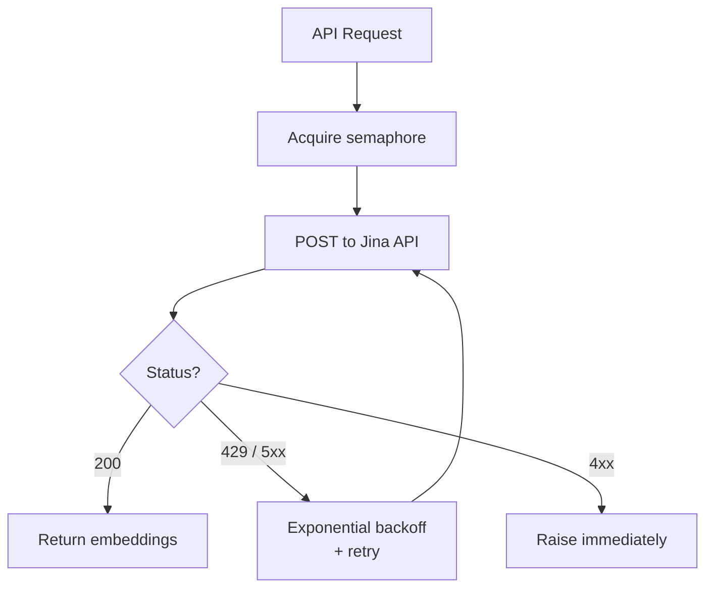

# Embeddings

Spektr uses **Jina v4** (`jina-embeddings-v4`) for all embeddings. The model supports both text and image inputs and produces two vector types: dense single-vector (2048d) and ColBERT multi-vector (128d per token).

**Source:** `ingestion/embedder.py`, `ingestion/jina_cocoindex_ops.py`

## Embedding Modes

| Mode | Dimensions | Use Case | Qdrant Collection |
|-|-|-|-|
| Dense | 2048 | Text and image similarity search | `documents_dense` |
| ColBERT | 128 per token | Visual late-interaction search | `documents_multivec` |

## `JinaV4Embedder`

Async embedding client using a shared `httpx.AsyncClient`.

### Constructor

```python
JinaV4Embedder(api_key: str | None = None)
```

Falls back to `settings.jina_api_key`. Creates an `httpx.AsyncClient` with 60s timeout and a concurrency semaphore bounded by `settings.jina_max_concurrent` (default: 5).

### Methods

| Method | Input | Output | Task | Dims |
|-|-|-|-|-|
| `embed_text(texts, task, dimensions)` | `list[str]` | `list[list[float]]` | `retrieval.passage` | 2048 |
| `embed_text_query(query, dimensions)` | `str` | `list[float]` | `retrieval.query` | 2048 |
| `embed_image(image_bytes, media_type)` | `bytes` | `list[float]` | `retrieval.passage` | 2048 |
| `embed_multi_vector(image_bytes, media_type)` | `bytes` | `list[list[float]]` | `retrieval.passage` | 128 |
| `embed_query_multi_vector(query)` | `str` | `list[list[float]]` | `retrieval.query` | 128 |
| `close()` | -- | -- | Closes httpx client | -- |

### API Details

All requests go to `https://api.jina.ai/v1/embeddings` with:

- `model`: `jina-embeddings-v4` (configurable via `settings.jina_model`)
- `normalized`: `true`
- `embedding_type`: `float`
- Images are base64-encoded as `data:{media_type};base64,{b64}`
- Image methods use a 120s timeout (vs 60s default)
- ColBERT mode uses `embedding_type_params: {"output_type": "colbert"}`

## Retry Logic

Retries are handled by `tenacity` with exponential backoff:

| Parameter | Value |
|-|-|
| Wait | Exponential, 2s min, 30s max |
| Max attempts | `settings.max_retries` (default: 3) |
| Retryable errors | HTTP 429 (rate limit), 5xx (server error) |
| Non-retryable | 4xx errors (except 429) raise immediately |



## Concurrency Control

All requests pass through an `asyncio.Semaphore` bounded by `settings.jina_max_concurrent` (default: 5). This prevents overwhelming the Jina API under high ingestion throughput.

## CocoIndex Ops Wrapper

`jina_cocoindex_ops.py` exposes the embedder as synchronous CocoIndex operations using a `_run_async` helper that bridges sync-to-async (see [CocoIndex Pipeline](cocoindex.md#_run_async-helper)).

| CocoIndex Op | Wraps | Description |
|-|-|-|
| `jina_embed_text(text)` | `embed_text([text])` | Text -> dense 2048d vector |
| `jina_embed_image(image_bytes)` | `embed_image(image_bytes)` | Image -> dense 2048d vector |
| `jina_embed_image_multivec(image_bytes)` | `embed_multi_vector(image_bytes)` | Image -> ColBERT 128d token vectors |

The embedder instance is lazily initialized as a module-level singleton (`_embedder`) on first use.

See also: [Pipeline Overview](overview.md) | [CocoIndex Pipeline](cocoindex.md) | [Architecture Data Flow](../architecture/data-flow.md)
