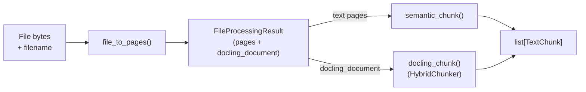

# File Processing

The `file_processor.py` module handles MIME classification, PDF page rendering, and text chunking. It transforms raw file bytes into structured `Page` and `TextChunk` objects consumed by the embedding and graph stages.

**Source:** `ingestion/file_processor.py`

## Data Flow



## Core Data Structures

### `Page`

Represents a single page extracted from a file.

|Field|Type|Description|
|-|-|-|
|`image_bytes`|`bytes`|PNG bytes for image/PDF pages; empty for text|
|`text`|`str`|Text content for text pages; empty for image|
|`page_number`|`int`|1-based page number|
|`content_type`|`str`|`"pdf"`, `"image"`, or `"text"`|
|`has_visual_content`|`bool`|`True` when the PDF page has at least one embedded image (via `fitz_page.get_images()`); always `False` for non-PDF pages|

### `TextChunk`

A chunk of text after chunking (semantic or HybridChunker).

|Field|Type|Description|
|-|-|-|
|`text`|`str`|Chunk text content|
|`chunk_index`|`int`|0-based index|
|`page_number`|`int`|Source page number|
|`contextualized_text`|`str \| None`|Heading-prefixed text from Docling `HybridChunker.contextualize()`. Used for late-chunking embeddings and as the input text for graph extraction. `None` when produced by `semantic_chunk()`.|

### `FileProcessingResult`

The wrapper returned from `file_to_pages()`.

|Field|Type|Description|
|-|-|-|
|`pages`|`list[Page]`|Per-page text/image data|
|`docling_document`|`object \| None`|Raw Docling `DoclingDocument` for the whole PDF, used as input to `docling_chunk()`. `None` for non-PDF inputs or when Docling is unavailable.|

## `file_to_pages()`

Classifies a file by MIME type and extension, then converts it to a `FileProcessingResult`.

```python
def file_to_pages(filename: str, content: bytes) -> FileProcessingResult
```

**Classification logic:**

|Condition|Result|
|-|-|
|`application/pdf` or `.pdf`|`_pdf_to_pages(content)` — see below|
|Image MIME or `.png .jpg .jpeg .gif .bmp .webp`|Single `Page` carrying the original image bytes|
|Text MIME or `.md .txt .csv .json .xml .html .yaml .yml`|Single `Page` with UTF-8 decoded text|
|Unknown|`FileProcessingResult(pages=[])` + warning log|

### PDF processing

`_pdf_to_pages(content)` does the following:

1. Open the PDF with **PyMuPDF** (`pymupdf.open(stream=content, filetype="pdf")`).
2. For each page:
    - Extract text via `fitz_page.get_text("text").strip()` (empty for scanned pages).
    - Render an image at **150 DPI** using `pymupdf.Matrix(150/72, 150/72)` and `fitz_page.get_pixmap(...).tobytes("png")`.
    - If text is empty (scanned page), call `_extract_text_docling(image_bytes)` as a Docling-based OCR fallback (returns `""` if Docling is not installed).
    - Set `has_visual_content = len(fitz_page.get_images()) > 0` — i.e. the page has embedded raster images. There is **no** Docling layout classification with `TableItem`/`PictureItem`/`FormulaItem` here; the heuristic is intentionally simple.
3. After per-page processing, `_convert_pdf_docling(content)` runs Docling once on the whole PDF to produce a `DoclingDocument`. This is purely so `docling_chunk()` can later run `HybridChunker` over it. Returns `None` on failure or when Docling is missing.

The result is `FileProcessingResult(pages=[...], docling_document=...)`.

## `semantic_chunk()`

Paragraph-boundary chunker used as a fallback when Docling/HybridChunker is not available.

```python
def semantic_chunk(
    text: str,
    max_chunk_size: int = 512,
    page_number: int = 1,
) -> list[TextChunk]
```

**Algorithm:**

1. Split text on `\n\n` into paragraphs.
2. Accumulate paragraphs into a chunk until adding the next paragraph would exceed `max_chunk_size` (default 512 characters).
3. When the limit is reached, emit the current chunk and start a new one.
4. If a single paragraph exceeds `max_chunk_size`, pass it to `_split_long_text()` (word-boundary split).

`semantic_chunk()` does **not** populate `contextualized_text` — only `docling_chunk()` does that.

## `docling_chunk()` and Late Chunking

```python
def docling_chunk(doc: object | None) -> list[TextChunk]
```

Runs Docling's `HybridChunker` over a `DoclingDocument` to produce semantically meaningful chunks aligned with document structure (headings, tables, etc.).

- **Tokenizer:** `HuggingFaceTokenizer.from_pretrained("jinaai/jina-embeddings-v4", max_tokens=256)`
- **`merge_peers=True`** so adjacent siblings are merged when they fit.
- For each chunk:
    - `text` is the raw chunk text.
    - `page_number` comes from `chunk.meta.doc_items[0].prov[0].page_no` (defaults to `1` if unavailable).
    - `contextualized_text` is filled with `chunker.contextualize(chunk)` (heading-prefixed). On exception this falls back to `None` and the warning is logged.
- Returns `[]` if `doc` is `None`, the chunker is unavailable, or the chunking call fails.

### Late chunking integration

Inside `pipeline._process_text_page`, when `docling_chunks` is non-empty for a page:

- The pipeline filters those chunks by `page_number` and passes them to `embedder.embed_text(..., late_chunking=True)`.
- For Jina v4 this means the **entire batch** is sent in a single API call so the model can apply contextualised late-chunking across all texts.
- The chunks' `contextualized_text` (when non-`None`) is also written to the Qdrant payload alongside the raw `text_content`, so retrieval-side rerankers/LLMs can see the heading context.

If `docling_chunk()` returns nothing (no `DoclingDocument`, or HybridChunker not installed), the pipeline falls back to `semantic_chunk(text, page_number=...)` without late-chunking.

## `_split_long_text()`

Word-boundary fallback for paragraphs exceeding `max_chunk_size`.

```python
def _split_long_text(text: str, max_size: int) -> list[str]
```

Iterates over words, accumulating into parts that stay within `max_size`. Never splits mid-word.

## Integration

`file_to_pages()`, `docling_chunk()`, and `semantic_chunk()` are called inside the [`ingest_file` CocoIndex op](cocoindex.md):

1. `result = file_to_pages(filename, content)` returns pages + Docling document.
2. `dl_chunks = docling_chunk(result.docling_document)` produces structure-aware chunks once.
3. For each text page, `_process_text_page` filters `dl_chunks` to that page (or falls back to `semantic_chunk`), embeds them, and writes points to `documents_dense`.
4. After all pages, the collected chunks are passed to `engine.ingest(...)` for graph extraction.

See also: [Pipeline Overview](overview.md) | [Architecture Data Flow](../architecture/data-flow.md)
