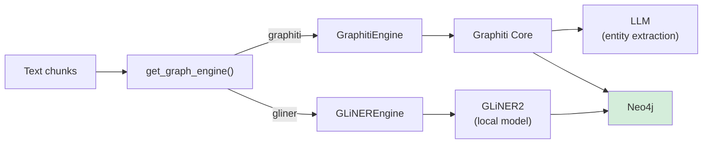

# Knowledge Graph

Spektr builds a knowledge graph in **Neo4j** with a pluggable extraction engine. The `GRAPH_ENGINE` setting selects between two backends:

| Engine | Setting | Extraction | Speed | Cost |
|-|-|-|-|-|
| **Graphiti** | `graphiti` (default) | LLM-based (GPT-4o class) | ~29 min / 74 chunks | ~$0.50-2.00 per doc |
| **GLiNER2** | `gliner` | Local 205MB model on CPU | ~5-15 sec / 74 chunks | $0.00 |

**Source:** `ingestion/graph_engine.py`, `ingestion/graph_writer.py`, `ingestion/graphiti_client.py`

## Architecture



Both engines implement the `GraphEngine` protocol and return `GraphFact` results. Pipeline and search tools are engine-agnostic.

## `GraphEngine` Protocol

```python
class GraphEngine(Protocol):
    async def ingest(self, chunks: list[TextChunk], source_key: str) -> None: ...
    async def search(self, query: str, limit: int = 10) -> list[GraphFact]: ...
    async def close(self) -> None: ...
```

The factory `get_graph_engine()` lazily creates a singleton based on `settings.graph_engine`. Call `close_graph_engine()` at shutdown.

## GraphitiEngine (`GRAPH_ENGINE=graphiti`)

Wraps the existing `GraphitiWriter` and Graphiti client. No behavior change from the pre-modular implementation.

### Ingestion

Each chunk becomes a Graphiti **episode** with name format: `{source_key}:p{page_number}:c{chunk_index}`. Graphiti's `add_episode()` internally:

1. Calls an LLM to extract entities and relationships
2. Merges discovered entities into the graph (deduplication by name)
3. Creates typed relationship edges with temporal metadata
4. Sets `created_at` on new edges and `expired_at` when relationships are superseded

Entity and relationship types are **LLM-discovered dynamically** -- no hardcoded taxonomy.

### Search

Delegates to `graphiti_client.search()` which returns edges with facts, sources, and timestamps. Results are mapped to `GraphFact` with `fact`, `source`, `created_at`, and `expired_at` fields.

### Temporal Awareness

Graphiti tracks time on all edges:

| Field | Description |
|-|-|
| `created_at` | When the relationship was first observed |
| `expired_at` | When the relationship was superseded by newer information |
| `reference_time` | The temporal anchor provided at ingestion time |

### Graphiti Client Singleton

`graphiti_client.py` manages the shared Graphiti client lifecycle.

| Function | Description |
|-|-|
| `get_graphiti()` | Returns (and lazily initializes) the singleton. On first call, connects to Neo4j, builds indices/constraints, and wires up LLM + embedder. |
| `close_graphiti()` | Closes the embedder and client, resets both singletons to `None`. |

### LLM Configuration

Graphiti's entity extraction uses `OpenAIGenericClient` (Chat Completions API), compatible with OpenRouter and any OpenAI-compatible endpoint:

| Setting | Env var | Description |
|-|-|-|
| `llm_api_key` | `LLM_API_KEY` | API key for the LLM provider |
| `llm_model` | `LLM_MODEL` | Model name (e.g. `openai/gpt-4.1`) |
| `llm_base_url` | `LLM_BASE_URL` | Base URL (e.g. `https://openrouter.ai/api/v1`) or omit for direct OpenAI |

> **Note:** `OpenAIGenericClient` is used instead of `OpenAIClient` because the Responses API is not supported by OpenRouter.
>
> **Warning:** Reasoning models (e.g. `o4-mini`) may not work -- they can return empty `content` fields, breaking Graphiti's extraction pipeline.

### Embedder Adapter

The client uses `_JinaGraphitiEmbedder` -- an adapter that wraps the project's own `JinaV4Embedder`, reusing the Jina v4 API for graph vector search.

## GLiNEREngine (`GRAPH_ENGINE=gliner`)

Uses the [GLiNER2](https://github.com/fastino-ai/GLiNER2) model for entity and relation extraction in a single forward pass. Zero LLM API calls.

### Setup

Install the optional dependency:

```bash
uv sync --extra gliner
```

The `gliner2` package is lazy-imported only when `GRAPH_ENGINE=gliner`, so Graphiti users don't need it installed.

### Model

- **Model:** `fastino/gliner2-base-v1` (205MB, downloaded on first use)
- **Context window:** 2,048 tokens (sufficient for typical chunks of 500-1500 chars)
- **NER quality:** 0.59 F1 on CrossNER (matches GPT-4o zero-shot)
- **Inference:** ~130ms per chunk on CPU

### Schema

Entity and relationship types are defined in `config/constants.py` as dicts with natural language descriptions that guide GLiNER2's extraction accuracy:

```python
ENTITY_TYPES = {
    "person": "A named individual, author, developer, ...",
    "technology": "A programming language, framework, library, tool, ...",
    ...
}
RELATIONSHIP_TYPES = {
    "created_by": "X was created, authored, or developed by Y",
    "uses": "X uses, depends on, or integrates Y",
    ...
}
```

These descriptions are passed directly to `GLiNER2.create_schema().entities()` and `.relations()`, which accept `dict[str, str]` for description-enhanced extraction.

### Ingestion

For each merged page text in a single Neo4j session:

1. `extractor.extract(text, schema)` returns entities and relations
2. Entities are upserted via `MERGE` on `name` only (not type), with normalized names (`.strip().title()`)
3. Entity `types` is stored as an array — multiple types accumulate if the same entity is extracted with different types across pages
4. Entity `description` is set to the first 500 chars of source text (used by full-text search)
5. Relationships are upserted via `apoc.merge.relationship` with `confidence` and `source` properties

### Post-Processing

Before writing to Neo4j, extracted data is filtered:

- **Self-referential relationships** (entity → itself) are skipped
- **Short entity names** (< 2 chars) are discarded
- **Stopword entities** (common English words like "the", "is", "copy") are filtered out

### Search

Uses a Neo4j full-text index (`entity_fulltext`) on `Entity.name` and `Entity.description`:

1. Query the full-text index for matching entities
2. Traverse outgoing relationships to connected entities
3. Format as `GraphFact` with `entities`, `relation_type`, and `confidence` fields
4. Deduplicate by fact string

The full-text index is created automatically by `neo4j_setup.py`.

### Neo4j Schema

Reuses the existing schema from `neo4j_setup.py`:

- `Entity(name, types[], description)` with uniqueness constraint on `(name)`
- `types` is an array property — entities accumulate types across extractions
- Typed relationship edges via APOC with `source` and `confidence` properties
- Full-text index on `Entity.name` + `Entity.description` for search

### Comparison

| Aspect | Graphiti | GLiNER2 |
|-|-|-|
| Entity extraction | LLM-discovered types | Schema-driven with descriptions from `constants.py` |
| Relation extraction | LLM-discovered, temporal | Schema-driven with descriptions, post-processed |
| Entity dedup | Automatic (Graphiti resolves) | MERGE on normalized `name`, types accumulated as array |
| Temporal tracking | Built-in `created_at`/`expired_at` | `first_seen`/`last_seen` only |
| Dependencies | LLM API key, network | None (local model) |

## `_LegacyGraphWriter` (Deprecated)

The `_LegacyGraphWriter` class uses raw Cypher queries to manually upsert documents, chunks, entities, and relationships. It is **deprecated** and kept only for backward compatibility. GLiNEREngine reuses its Cypher patterns but with GLiNER2 extraction instead of external entity extraction.

## Concurrency & Tuning

### Graphiti engine

| Setting | Env var | Default | Scope |
|-|-|-|-|
| `graphiti_concurrency` | `GRAPHITI_CONCURRENCY` | `3` | Max concurrent episode ingestions per page |
| `graph_semaphore_limit` | `GRAPH_SEMAPHORE_LIMIT` | `10` | Max concurrent LLM calls within Graphiti |

### GLiNER engine

GLiNER2 extraction is synchronous and CPU-bound (~130ms/chunk). No concurrency settings needed -- chunks are processed sequentially within a single Neo4j session for optimal throughput.

## Integration

The pipeline uses `get_graph_engine()` to obtain the singleton engine instance:

1. If any page has `content_type == "text"`, the graph engine is obtained via `get_graph_engine()`
2. For each text page, `semantic_chunk()` produces chunks
3. Chunks are passed to `engine.ingest(chunks, source_key)`
4. At pipeline end, `close_graph_engine()` shuts down the singleton

See also: [Pipeline Overview](overview.md) | [File Processing](file-processing.md) | [Architecture Data Flow](../architecture/data-flow.md)
