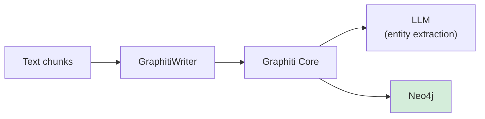
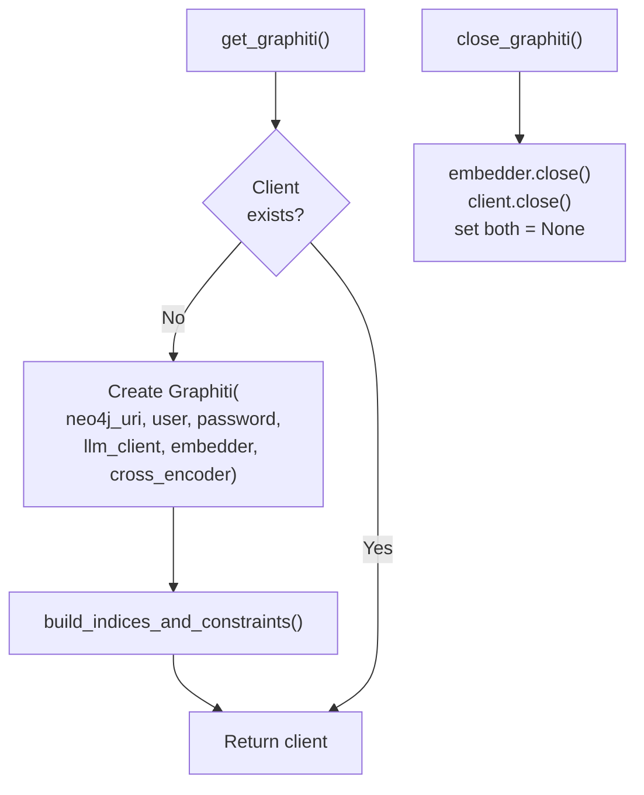

# Knowledge Graph

Spektr builds a temporal knowledge graph in **Neo4j** using **Graphiti**. Text chunks are ingested as episodes; Graphiti's internal LLM pipeline handles entity extraction, relationship discovery, and temporal metadata automatically.

**Source:** `ingestion/graph_writer.py`, `ingestion/graphiti_client.py`

## Architecture



Only **text content** flows to the knowledge graph. Visual content (PDF pages, images) is stored in Qdrant only.

## `GraphitiWriter`

Primary writer class. Wraps Graphiti's `add_episode` API.

### `ingest_chunk()`

```python
async def ingest_chunk(
    self,
    chunk_text: str,
    source_key: str,
    page_number: int,
    chunk_index: int,
    reference_time: datetime | None = None,
) -> None
```

| Parameter | Description |
|-|-|
| `chunk_text` | The text content of the chunk |
| `source_key` | File path / S3 key identifying the source document |
| `page_number` | 1-based page number |
| `chunk_index` | 0-based chunk index within the page |
| `reference_time` | Temporal anchor for the episode (defaults to `datetime.now()`) |

Each chunk becomes a Graphiti **episode** with name format: `{source_key}:p{page_number}:c{chunk_index}`

### Episode Ingestion

Graphiti's `add_episode()` internally:

1. Calls an LLM to extract entities and relationships from the episode text
2. Merges discovered entities into the graph (deduplication by name)
3. Creates typed relationship edges with temporal metadata
4. Sets `created_at` on new edges and `expired_at` when relationships are superseded

**Entity and relationship types are LLM-discovered dynamically** -- there is no hardcoded taxonomy. The LLM determines appropriate types based on the content.

## Temporal Awareness

Graphiti tracks time on all edges:

| Field | Description |
|-|-|
| `created_at` | When the relationship was first observed |
| `expired_at` | When the relationship was superseded by newer information |
| `reference_time` | The temporal anchor provided at ingestion time |

This enables time-aware queries: "What was true at time T?" rather than just "What is true now?"

## Graphiti Client Singleton

`graphiti_client.py` manages the shared Graphiti client lifecycle.



| Function | Description |
|-|-|
| `get_graphiti()` | Returns (and lazily initializes) the singleton. On first call, connects to Neo4j, builds indices/constraints, and wires up LLM + embedder. |
| `close_graphiti()` | Closes the embedder and client, resets both singletons to `None`. |

### LLM Configuration

Graphiti's entity extraction uses `OpenAIGenericClient` (Chat Completions API), which is compatible with OpenRouter and any OpenAI-compatible endpoint. Configure via:

| Setting | Env var | Description |
|-|-|-|
| `llm_api_key` | `LLM_API_KEY` | API key for the LLM provider |
| `llm_model` | `LLM_MODEL` | Model name (e.g. `openai/gpt-4.1`) |
| `llm_base_url` | `LLM_BASE_URL` | Base URL (e.g. `https://openrouter.ai/api/v1`) or omit for direct OpenAI |

> **Note:** `OpenAIGenericClient` is used instead of `OpenAIClient` because the Responses API (`OpenAIClient`) is not supported by OpenRouter. Use Chat Completions-compatible models only.
>
> **Warning:** Reasoning models (e.g. `o4-mini`) may not work — they can return empty `content` fields in responses, breaking Graphiti's extraction pipeline. Use standard chat completion models like `openai/gpt-4.1`.

### Embedder Adapter

Rather than using `OpenAIEmbedder` (which requires a separate OpenAI embeddings endpoint), the client uses `_JinaGraphitiEmbedder` — an adapter that wraps the project's own `JinaV4Embedder`. This reuses the Jina v4 API for graph vector search, keeping embeddings consistent across vector store and knowledge graph.

`EMBEDDING_DIM=2048` is set via `os.environ.setdefault` at module import time to match Jina's output dimension, since Graphiti reads this at import time for vector index sizing.

The adapter implements both `create()` (single or batch input, returns first vector) and `create_batch()` (returns all vectors) using Graphiti's `EmbedderClient` interface.

### Cross-encoder (Reranker)

`OpenAIRerankerClient` is used with the same `LLMConfig` as the LLM client. It reranks graph search results using the configured chat completions model.

The client connects to Neo4j using `settings.neo4j_uri`, `settings.neo4j_user`, and `settings.neo4j_password`.

## `_LegacyGraphWriter` (Deprecated)

The `_LegacyGraphWriter` class (aliased as `GraphWriter` for backward compatibility) uses raw Cypher queries to manually upsert documents, chunks, entities, and relationships. It is **deprecated** and kept only for backward compatibility during the transition to Graphiti.

Key differences from `GraphitiWriter`:

| Aspect | `_LegacyGraphWriter` | `GraphitiWriter` |
|-|-|-|
| Entity extraction | External (via `entity_extractor.py`) | Internal (Graphiti's LLM pipeline) |
| Temporal tracking | Manual `first_seen` / `last_seen` | Automatic `created_at` / `expired_at` |
| Graph operations | Raw Cypher + APOC | Graphiti API |
| Status | Deprecated | Active |

## Integration

`GraphitiWriter` is used in `pipeline.py` inside the `ingest_file` op:

1. If any page has `content_type == "text"`, a `GraphitiWriter` is created
2. For each text page, `semantic_chunk()` produces chunks
3. Each chunk is ingested via `graphiti_writer.ingest_chunk()`
4. The writer is closed in a `finally` block

See also: [Pipeline Overview](overview.md) | [File Processing](file-processing.md) | [Architecture Data Flow](../architecture/data-flow.md)
