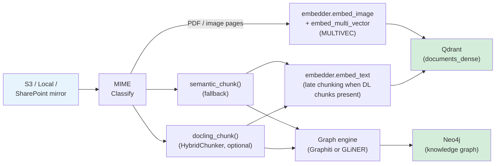
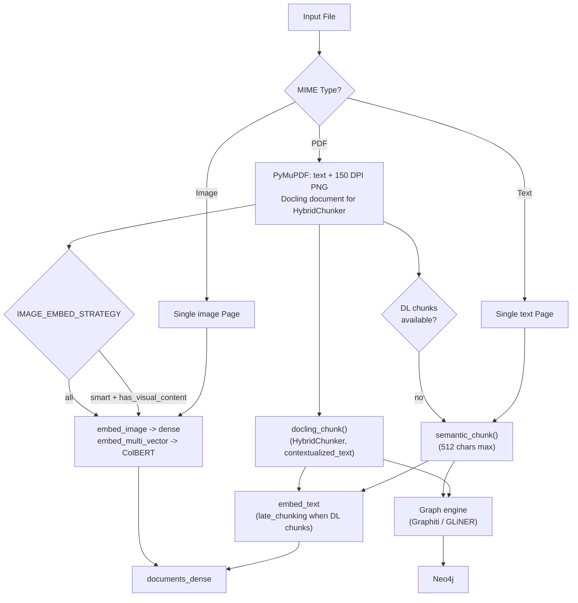

# Ingestion Pipeline Overview

Spektr has two ingestion paths sharing the same storage backends (Qdrant + Neo4j):

- **Path A (Bulk KB):** CocoIndex batch pipeline processes documents from S3, local filesystem, or a SharePoint mirror. Uses GLiNER2 or Graphiti for graph extraction with optional per-document schema induction (GLiNER only).
- **Path B (Live):** Lightweight FastAPI HTTP endpoint ingests streaming text data in real time. Uses Graphiti for temporal episodic memory with fact evolution tracking.

## Path A: Bulk KB Pipeline

### Stage breakdown

|Stage|Module|Description|
|-|-|-|
|Source|`pipeline.py`|CocoIndex reads from S3 (via SQS), local `documents/`, or the SharePoint local mirror|
|Classify|`file_processor.py`|MIME-detect file type, return `FileProcessingResult` with `Page`s and an optional Docling `DoclingDocument`|
|Chunk|`file_processor.py`|`docling_chunk()` (HybridChunker, Jina v4 tokenizer) when a Docling document is available; `semantic_chunk()` paragraph fallback otherwise|
|Embed|`embedders/{jina,voyage,openrouter}.py`|Provider-agnostic dense embeddings (provider-default dimensions); ColBERT 128d via Jina only|
|Store|`pipeline.py`|Upsert vectors to Qdrant with `embedder_model` + `embedder_dim` in every payload|
|Schema|`schema_inducer.py`|Per-document LLM call proposing domain-specific entity/relationship types (GLiNER only, when `SCHEMA_INDUCTION_ENABLED=true`)|
|Graph|`graph_engine.py`|Ingest text chunks into Neo4j via pluggable engine (Graphiti or GLiNER2)|

## Supported File Types

|Category|Extensions|Processing|
|-|-|-|
|PDF|`.pdf`|PyMuPDF text extraction + 150 DPI PNG render. `has_visual_content = len(fitz_page.get_images()) > 0`. Optional Docling `DoclingDocument` powers HybridChunker for late-chunking.|
|Images|`.png`, `.jpg`, `.jpeg`, `.gif`, `.bmp`, `.webp`|Embedded directly (dense + ColBERT multi-vector when `MULTIVEC_ENABLED`)|
|Text|`.md`, `.txt`, `.csv`, `.json`, `.xml`, `.html`, `.yaml`, `.yml`|Chunked, embedded as text, sent to graph engine|

## Data Flow by Content Type

## Path B: Live Ingestion

A standalone FastAPI app (`ingestion/live_ingest.py`) on `LIVE_INGEST_PORT` (default 8001) accepts streaming text via HTTP POST and makes it searchable within seconds. Vector embedding is synchronous (so the response only returns after Qdrant has the new chunk); Graphiti episode ingestion runs as a background task.

### Endpoints

|Endpoint|Method|Auth|Description|
|-|-|-|-|
|`/session/start`|POST|Bearer `INGEST_API_KEY`|Create a session; returns a per-session `session_token` used by the next two calls|
|`/ingest/chunk`|POST|Bearer `session_token`|Ingest a single text chunk; embed → Qdrant immediately, Graphiti as background task|
|`/session/end`|POST|Bearer `session_token`|End the session: archive (`archive=true`) **flips `is_live=False` on existing Qdrant points** so the data stays searchable as historical content, or discard (`archive=false`) which deletes the points and the Graphiti group|

There is one active session at a time (v1). When `INGEST_API_KEY` is empty, both auth checks are disabled.

### Request / response schemas

(All bodies are JSON. Datetimes are ISO 8601.)

`POST /session/start` request — `SessionStartRequest`:

|Field|Type|Notes|
|-|-|-|
|`session_id`|`str`|Caller-chosen identifier; used as Qdrant payload key and Graphiti `group_id`|
|`metadata`|`dict`|Optional, free-form, stored only on the in-memory session record|

Response (200): `{ "session_id": str, "session_token": str, "status": "active", "created_at": iso8601 }`. Response 409 if a session is already active. 401/403 on missing/invalid `INGEST_API_KEY`.

`POST /ingest/chunk` request — `LiveChunk`:

|Field|Type|Notes|
|-|-|-|
|`session_id`|`str`|Must match the active session's id|
|`text`|`str`|Text content|
|`timestamp`|`datetime`|Used as Qdrant payload `timestamp` and Graphiti `reference_time`|

Response (200): `IngestResponse = { status: "accepted", vector_indexed: true, graph_status: "processing" }`. 400 if `session_id` doesn't match the active session. 404 if no active session. 401/403 on bad token.

`POST /session/end` request — `SessionEndRequest`:

|Field|Type|Notes|
|-|-|-|
|`session_id`|`str`|Must match the active session|
|`archive`|`bool`|Defaults to `False`. `True` keeps Qdrant points but flips `is_live=False`; `False` deletes points and the Graphiti group.|

Response (200): `{ "session_id": str, "status": "archived" \| "discarded" }`. 404 if `session_id` doesn't match.

### Qdrant payload fields for live points

Live session points are written into the same `documents_dense` collection used by Path A, carrying the same named vectors: `dense` (the configured embedder) and `sparse` (miniCOIL, encoded synchronously via `asyncio.to_thread` since `fastembed` is blocking). See [Embeddings — Sparse Channel](embeddings.md#sparse-channel-minicoil). The payload schema is:

|Field|Type|Notes|
|-|-|-|
|`source_file`|`str`|Always `"session:<session_id>"`|
|`content_type`|`str`|`"live"`|
|`is_live`|`bool`|`True` while session is active; flipped to `False` on `archive=true` end|
|`session_id`|`str`|Mirrors `LiveChunk.session_id`|
|`timestamp`|`str`|ISO 8601 from `LiveChunk.timestamp`|
|`text_content`|`str`|Text content|
|`page_number`|`int`|Always `0` for live session points|
|`embedder_model`|`str`|Model identifier from the embedder (matches Path A)|
|`embedder_dim`|`int`|Embedding dimensionality from the embedder|
|`metadata`|`dict`|Empty dict by default|

Search tools that need to filter live vs archived data use `is_live` and/or `session_id` as Qdrant filter conditions.

### Processing flow

1. Text chunk arrives via HTTP POST with `session_id`, `text`, `timestamp`, and optional metadata fields.
2. The configured embedder produces the `dense` vector and miniCOIL produces the `sparse` vector; the live ingest upserts a single point carrying both named vectors to `documents_dense`. The response returns here (~200ms with Jina).
3. A background `asyncio.create_task` sends the chunk to Graphiti as an episode with `group_id=session_id` and `reference_time=timestamp` (typically 2–5s).

Vector search is available immediately after step 2. Graph search catches up when step 3 completes.

See [Knowledge Graph](knowledge-graph.md) for details on Graphiti's temporal episodic model.

## Key Design Decisions

- **Two ingestion paths** — bulk documents and streaming data have fundamentally different requirements (batch vs push, multimodal vs text-only, flat entities vs temporal episodes). Clean separation is simpler than forced unification.
- **All processing happens inside `ingest_file`** (Path A) — a single CocoIndex custom op that writes directly to Qdrant and Neo4j. CocoIndex handles source management, incremental state, and the delete connector only.
- **Provider-default dense dimensions** — Qdrant's `documents_dense` collection is sized at provisioning from `settings.dense_dimensions` (Jina default 2048, Voyage 1024, OpenRouter 3072). All points carry `embedder_model` and `embedder_dim` so drift can be detected.
- **Smart image embedding** — for `IMAGE_EMBED_STRATEGY=smart` (default), only PDF pages with at least one embedded raster image (`fitz_page.get_images()`) are image-embedded. `IMAGE_EMBED_STRATEGY=all` embeds every PDF page. Pure image files are always embedded.
- **Late chunking** — when Docling is installed, `HybridChunker` (Jina v4 tokenizer, 256 max tokens) produces structure-aware chunks with `contextualized_text` (heading-prefixed). Jina v4 receives the per-page batch as a single API call with `late_chunking=True`. `semantic_chunk()` is the plain paragraph fallback.
- **Dynamic schema induction** (Path A, GLiNER only) — when `SCHEMA_INDUCTION_ENABLED=true` and `GRAPH_ENGINE=gliner`, a single LLM call per document proposes domain-specific entity/relationship types from a sample of the first 3 chunks. Results are cached by SHA256 of the first 500 chars (TTL `SCHEMA_CACHE_TTL`, default 3600s). If the sample is shorter than `_MIN_TEXT_LEN = 200` chars, induction is skipped and the base schema is used.
- **Pluggable graph engine** — `GRAPH_ENGINE` selects Graphiti (LLM-based, slow, rich) or GLiNER2 (local CPU, fast, cheap). Both implement the same `GraphEngine` protocol. See [Knowledge Graph](knowledge-graph.md).
- **Failure semantics** — `ingest_file` re-raises on failure so CocoIndex retries; after `PIPELINE_MAX_RETRIES` (default 3) failures the poison-pill kicks in: log CRITICAL, swallow, mark processed. Counts persist in `state/ingestion_failures.db` and reset on success.
- **Text content flows to both stores** — Qdrant for vector search, Neo4j for entity/relationship queries.
- **Text tasks run concurrently, image tasks run sequentially** — image embeddings are far heavier per request and would blow TPM limits in parallel. The pipeline splits tasks by type accordingly.
- **Per-file timeout with graceful cancellation** — each file gets a `PIPELINE_TIMEOUT` (default 3600s). On expiry, in-flight tasks are cancelled and the failure is recorded.
- **TPM-aware rate limiting (Jina)** — a dual TokenBucket system (RPM + TPM) estimates token cost before each API call and throttles accordingly. Image token cost is estimated by tiling 28×28 patches at ~10 tokens/tile (`_FALLBACK_TOKENS = 2000` if PIL decoding fails).
- **Graphiti uses the same project embedder** — a thin adapter (`_JinaGraphitiEmbedder` in `graphiti_client.py`) delegates Graphiti's embedding requests to `create_embedder()`, sharing rate limiters. `graphiti_client.py` also writes `EMBEDDING_DIM=512` to `os.environ` at import time to size Graphiti's vector index.

## Module Map

|File|Path|Docs|
|-|-|-|
|`file_processor.py`|A|[File Processing](file-processing.md)|
|`embedder.py`|A + B|[Embeddings](embeddings.md)|
|`embedders/jina.py`|A + B|[Embeddings](embeddings.md)|
|`embedders/voyage.py`|A + B|[Embeddings](embeddings.md)|
|`embedders/openrouter.py`|A + B|[Embeddings](embeddings.md)|
|`cocoindex_ops.py`|A|[CocoIndex Pipeline](cocoindex.md)|
|`schema_inducer.py`|A|[Knowledge Graph](knowledge-graph.md)|
|`graph_engine.py`|A|[Knowledge Graph](knowledge-graph.md)|
|`graph_writer.py`|A|[Knowledge Graph](knowledge-graph.md)|
|`graphiti_client.py`|A + B|[Knowledge Graph](knowledge-graph.md)|
|`live_ingest.py`|B|This page (Path B section above)|
|`pipeline.py`|A|[CocoIndex Pipeline](cocoindex.md)|
|`target_connector.py`|A|[CocoIndex Pipeline](cocoindex.md)|
|`_failure_tracker.py`|A|[CocoIndex Pipeline](cocoindex.md)|

See also: [Architecture Data Flow](../architecture/data-flow.md)
