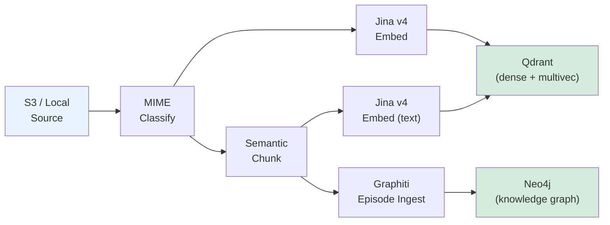
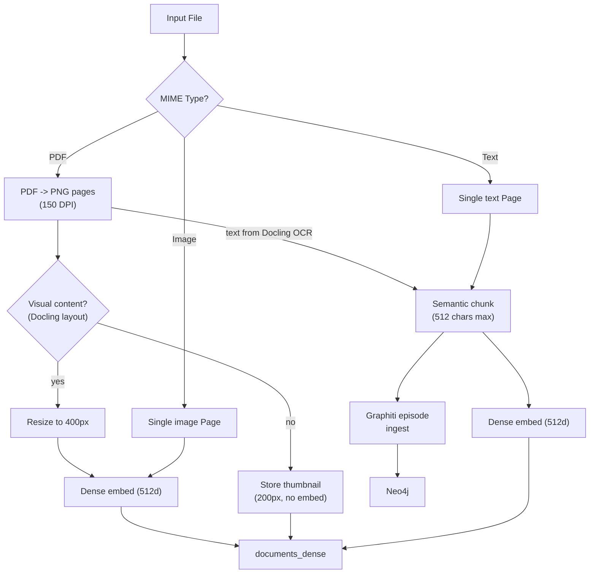

# Ingestion Pipeline Overview

The ingestion pipeline processes documents from AWS S3 (or a local directory) into a dual knowledge store: **Qdrant** for vector search and **Neo4j** (via Graphiti) for temporal knowledge graph queries.

## Pipeline Stages

### Stage breakdown

| Stage | Module | Description |
|-|-|-|
| Source | `pipeline.py` | CocoIndex reads from S3 (via SQS) or local `documents/` dir |
| Classify | `file_processor.py` | MIME-detect file type, convert to `Page` objects |
| Chunk | `file_processor.py` | `semantic_chunk()` splits text on paragraph boundaries |
| Embed | `embedders/jina.py` or `embedders/voyage.py` | Provider-agnostic dense (512d, Matryoshka) + ColBERT (128d) embeddings |
| Store | `pipeline.py` | Upsert vectors to Qdrant collections |
| Graph | `graph_writer.py` / `graphiti_client.py` | Ingest text chunks as Graphiti episodes into Neo4j |

## Supported File Types

| Category | Extensions | Processing |
|-|-|-|
| PDF | `.pdf` | Docling layout analysis + PyMuPDF rendering at 150 DPI; visual pages image-embedded, text-only pages get thumbnails |
| Images | `.png`, `.jpg`, `.jpeg`, `.gif`, `.bmp`, `.webp` | Embedded directly (dense + ColBERT multi-vector) |
| Text | `.md`, `.txt`, `.csv`, `.json`, `.xml`, `.html`, `.yaml`, `.yml` | Semantic chunked, embedded as text, ingested to Graphiti |

## Data Flow by Content Type

## Key Design Decisions

- **All processing happens inside `ingest_file`** -- a single CocoIndex custom op that writes directly to Qdrant and Neo4j. CocoIndex handles source management and incremental state only.
- **Text content flows to both stores** -- Qdrant for vector search, Neo4j for entity/relationship queries.
- **Smart image embedding** -- Docling layout analysis classifies each PDF page. Only pages with figures, tables, or formulas are image-embedded (resized to 400px). Text-only pages store a lightweight thumbnail instead. This reduces embedding cost by ~90% on text-heavy PDFs.
- **State tracked in PostgreSQL** -- CocoIndex maintains `ingestion_log` for incremental processing.
- **Text tasks run concurrently, image tasks run sequentially** -- image embeddings consume 50-100k+ tokens each and would blow TPM limits if run in parallel. The pipeline splits tasks by type and processes them accordingly.
- **TPM-aware rate limiting** -- a dual TokenBucket system (RPM + TPM) estimates token cost before each API call and throttles accordingly.
- **Graphiti uses the same Jina embedder** -- a thin adapter (`_JinaGraphitiEmbedder`) delegates graph embedding requests to the project's Jina/Voyage embedder, sharing rate limiters.

## Module Map

| File | Docs |
|-|-|
| `file_processor.py` | [File Processing](file-processing.md) |
| `embedder.py` | [Embeddings](embeddings.md) |
| `embedders/jina.py` | [Embeddings](embeddings.md) |
| `embedders/voyage.py` | [Embeddings](embeddings.md) |
| `cocoindex_ops.py` | [CocoIndex Pipeline](cocoindex.md) |
| `graph_writer.py` | [Knowledge Graph](knowledge-graph.md) |
| `graphiti_client.py` | [Knowledge Graph](knowledge-graph.md) |
| `pipeline.py` | [CocoIndex Pipeline](cocoindex.md) |

See also: [Architecture Data Flow](../architecture/data-flow.md)
