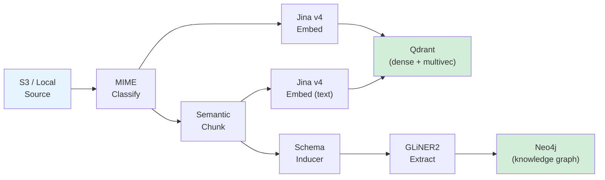
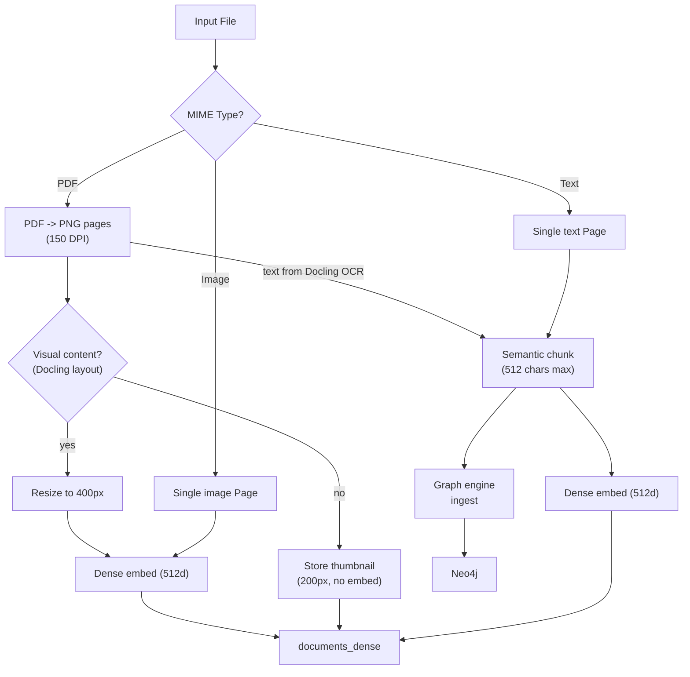

# Ingestion Pipeline Overview

Spektr has two ingestion paths sharing the same storage backends (Qdrant + Neo4j):

- **Path A (Bulk KB):** CocoIndex batch pipeline processes documents from S3 or local filesystem. Uses GLiNER2 for entity extraction with optional per-document schema induction.
- **Path B (Live):** Lightweight FastAPI HTTP endpoint ingests streaming text data in real time. Uses Graphiti for temporal episodic memory with fact evolution tracking.

## Path A: Bulk KB Pipeline

### Stage breakdown

| Stage | Module | Description |
|-|-|-|
| Source | `pipeline.py` | CocoIndex reads from S3 (via SQS) or local `documents/` dir |
| Classify | `file_processor.py` | MIME-detect file type, convert to `Page` objects |
| Chunk | `file_processor.py` | `semantic_chunk()` splits text on paragraph boundaries |
| Embed | `embedders/jina.py` or `embedders/voyage.py` | Provider-agnostic dense (512d, Matryoshka) + ColBERT (128d) embeddings |
| Store | `pipeline.py` | Upsert vectors to Qdrant collections |
| Schema | `schema_inducer.py` | Per-document LLM call proposes domain-specific entity/relationship types (GLiNER2 only, when `SCHEMA_INDUCTION_ENABLED=true`) |
| Graph | `graph_engine.py` | Ingest text chunks into Neo4j via pluggable engine (Graphiti or GLiNER2) |

## Supported File Types

| Category | Extensions | Processing |
|-|-|-|
| PDF | `.pdf` | Docling layout analysis + PyMuPDF rendering at 150 DPI; visual pages image-embedded, text-only pages get thumbnails |
| Images | `.png`, `.jpg`, `.jpeg`, `.gif`, `.bmp`, `.webp` | Embedded directly (dense + ColBERT multi-vector) |
| Text | `.md`, `.txt`, `.csv`, `.json`, `.xml`, `.html`, `.yaml`, `.yml` | Semantic chunked, embedded as text, ingested to Graphiti |

## Data Flow by Content Type

## Path B: Live Ingestion

A standalone FastAPI app (`ingestion/live_ingest.py`) on port `LIVE_INGEST_PORT` (default 8001) accepts streaming text data via HTTP POST and makes it searchable within seconds.

### Endpoints

| Endpoint | Method | Description |
|-|-|-|
| `/session/start` | POST | Creates a session with a `session_id` and optional metadata. Returns a `session_token` for subsequent calls |
| `/ingest/transcript` | POST | Ingests a text chunk: embeds to Qdrant immediately (~200ms), ingests to Graphiti as a background task (~2-5s) |
| `/session/end` | POST | Ends a session. `archive=true` keeps data permanently; `archive=false` purges all session data from Qdrant and Neo4j |

### Authentication

When `INGEST_API_KEY` is set, all live ingest endpoints are protected:

- **`/session/start`** requires `Authorization: Bearer <INGEST_API_KEY>` and returns a `session_token`
- **`/ingest/transcript`** and **`/session/end`** require `Authorization: Bearer <session_token>`

Session tokens are ephemeral — generated per session, scoped to that session only, and wiped on session end. When `INGEST_API_KEY` is empty (default), authentication is disabled.

### Processing flow

1. Text chunk arrives via HTTP POST with `session_id`, `text`, `timestamp`, and optional `speaker`
2. Jina embeds the chunk and upserts to Qdrant `documents_dense` with `is_live=true` and `session_id` in the payload — **response returns here** (~200ms)
3. Background task sends the chunk to Graphiti as an episode with `group_id=session_id` and `reference_time=timestamp` (~2-5s)

Vector search is available immediately after step 2. Graph search catches up when step 3 completes. One active session at a time (v1).

See [Knowledge Graph](knowledge-graph.md) for details on Graphiti's temporal episodic model.

## Key Design Decisions

- **Two ingestion paths** -- bulk documents and streaming data have fundamentally different requirements (batch vs push, multimodal vs text-only, flat entities vs temporal episodes). Clean separation is simpler than forced unification.
- **All processing happens inside `ingest_file`** (Path A) -- a single CocoIndex custom op that writes directly to Qdrant and Neo4j. CocoIndex handles source management and incremental state only.
- **Dynamic schema induction** (Path A) -- when `SCHEMA_INDUCTION_ENABLED=true` and `GRAPH_ENGINE=gliner`, a single LLM call per document proposes domain-specific entity/relationship types. Results are cached by content hash (SHA256 of first 500 chars) with configurable TTL. If the document text is < 200 chars, the base schema is used as fallback.
- **Text content flows to both stores** -- Qdrant for vector search, Neo4j for entity/relationship queries.
- **Smart image embedding** -- Docling layout analysis classifies each PDF page. Only pages with figures, tables, or formulas are image-embedded (resized to 400px). Text-only pages store a lightweight thumbnail instead. This reduces embedding cost by ~90% on text-heavy PDFs.
- **State tracked in PostgreSQL** -- CocoIndex maintains `ingestion_log` for incremental processing.
- **Text tasks run concurrently, image tasks run sequentially** -- image embeddings consume 50-100k+ tokens each and would blow TPM limits if run in parallel. The pipeline splits tasks by type and processes them accordingly.
- **Per-file timeout with graceful cancellation** -- each file gets a `PIPELINE_TIMEOUT` (default 3600s). On expiry, `asyncio.wait_for` cancels all in-flight tasks cleanly instead of crashing the executor pool.
- **Pluggable graph engine** -- `GRAPH_ENGINE` selects Graphiti (LLM-based, ~29 min/doc) or GLiNER2 (local CPU, ~15 sec/doc). Both implement the same `GraphEngine` protocol. See [Knowledge Graph](knowledge-graph.md).
- **TPM-aware rate limiting** -- a dual TokenBucket system (RPM + TPM) estimates token cost before each API call and throttles accordingly.
- **Graphiti uses the same Jina embedder** -- a thin adapter (`_JinaGraphitiEmbedder`) delegates graph embedding requests to the project's Jina/Voyage embedder, sharing rate limiters.

## Module Map

| File | Path | Docs |
|-|-|-|
| `file_processor.py` | A | [File Processing](file-processing.md) |
| `embedder.py` | A + B | [Embeddings](embeddings.md) |
| `embedders/jina.py` | A + B | [Embeddings](embeddings.md) |
| `embedders/voyage.py` | A + B | [Embeddings](embeddings.md) |
| `cocoindex_ops.py` | A | [CocoIndex Pipeline](cocoindex.md) |
| `schema_inducer.py` | A | [Knowledge Graph](knowledge-graph.md) |
| `graph_engine.py` | A | [Knowledge Graph](knowledge-graph.md) |
| `graph_writer.py` | A | [Knowledge Graph](knowledge-graph.md) |
| `graphiti_client.py` | A + B | [Knowledge Graph](knowledge-graph.md) |
| `live_ingest.py` | B | This page (Path B section above) |
| `pipeline.py` | A | [CocoIndex Pipeline](cocoindex.md) |

See also: [Architecture Data Flow](../architecture/data-flow.md)
